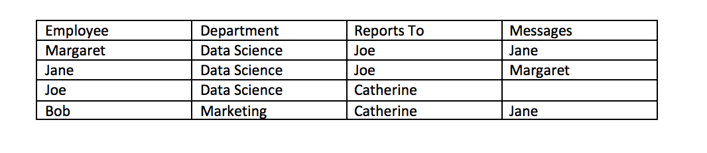
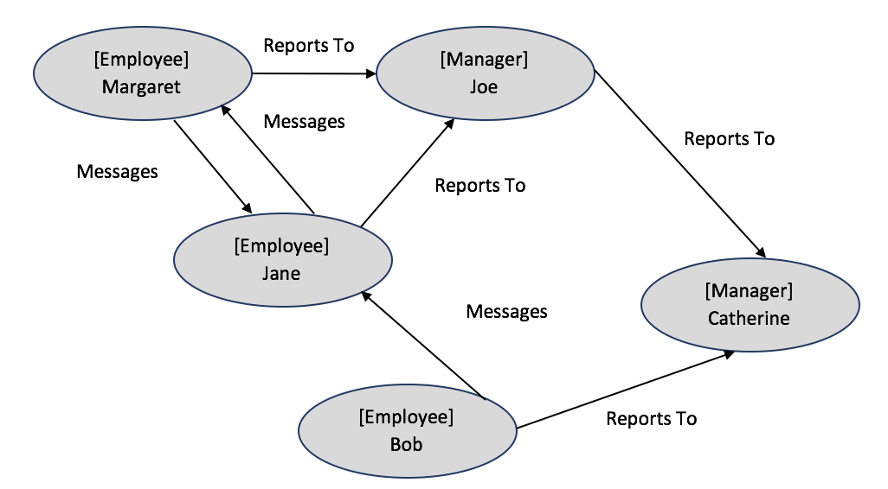
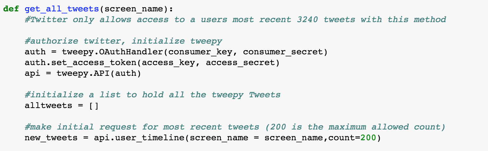
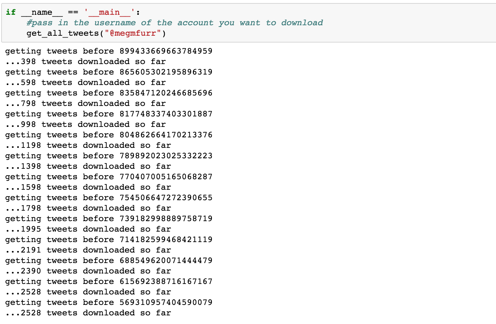
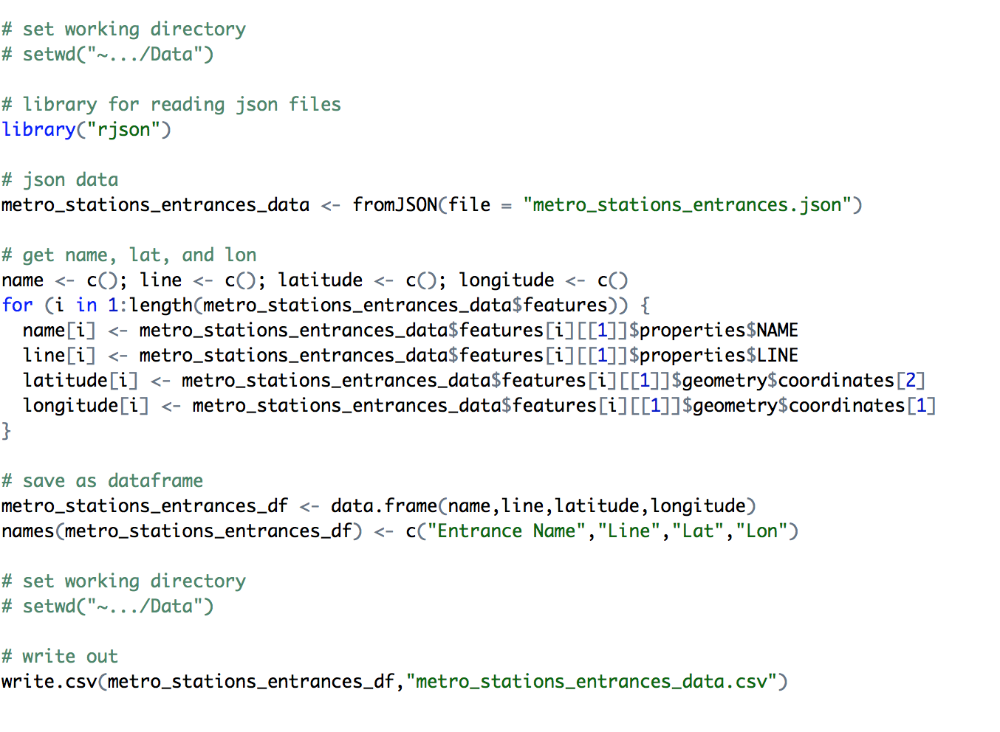

## BLOG
In this blog, I want to start sharing my journey through [the age of the algorithm](https://maisonneuve.org/article/2011/05/9/age-algorithm/) and take the time to publish some of the ways in which I work with data in my day to day life.

 

### Understanding Social Networks (written on 1/2/2018)
Psychologists, sociologists, and anthropologists are some of the first to study a branch of “mathematical” social science to understand social structures through [social network analysis]( http://moreno.ss.uci.edu/91.pdf). Since the early days, computational networks have been developed. Facebook, a social media site that many people in my generation (generation y) grew up using, is a notorious example of a social network whose data representing the network is stored in a graph database, a database for data structures with nodes, properties of nodes, and relationships between nodes, is used in algorithms. An example of data from the Facebook workplace social network might include the following the data:

 

 

### Creating R Packages and Python Modules (written on 1/1/2018)
A few weeks ago [Meet the man behind the most important tool in data science](https://qz.com/1126615/the-story-of-the-most-important-tool-in-data-science/) was published in the New York Times on [Pandas, a Python library](http://pandas.pydata.org) that is used for some of the basic data manipulation work in data science. I resonated a lot with some of his story as expressed particularly through the sentence, "McKinney said it became clear to him by the middle of 2012 that Pandas was taking off. He didn’t take much time to bask in its success. The original code was 'inelegant,' he says, so he spent years improving the backbone of the tool, and trying to add features. McKinney attributes Pandas’s prominence, in large part, to his willingness to be vulnerable. 'With any creative project, but particularly with open source, it can be terrifying because you are opening yourself up to criticism from anybody,' he notes. The key is to welcome that criticism, he stressed."

Often, I've discovered over the past years that when analyzing or modeling data in the practice of data science and engineering, functions and methods must be written. With my company, I've been writing functions to turn [code that a biologist might write](https://nicercode.github.io/guides/functions/before.html) into [code that a data scientist might write](https://nicercode.github.io/guides/functions/after.html). Many of my functions depend on functions from other libraries like [dplyr](http://dplyr.tidyverse.org), but because analysis is more complicated, I enjoy the art and science of creating my own on top, making code progressively more elegant, and testing the applicability of them. While tools like dplyr and pandas exist already, sometimes more code has to be written, and developing the ability to write good code and contribute it to open source communities, even when criticism may be waiting, is fundamental to the practice of data science. Writing higher quality code and opening myself up to criticism along the way has supported transforming a longer process into one that is more enjoyable and involves more analytical problem solving.

To keep scripts clean, code readable and re-usable, and tasks efficient, I've also begun to teach myself how to create a package for functional code. With a package, I can incorporate the code I write more easily and make it easier for others to begin reading and using my code. Hilary Parker has written a [blogpost](https://hilaryparker.com/2014/04/29/writing-an-r-package-from-scratch/) on this, so I won't explain how to create a package in much detail. Adding functions into an R file that is part of a package, processing detailed and consistent documentation, and creating a git repo for the package is a step in the write direction for any data analyst or scientist as he/she begin his/her journey through "the age of the algorithm." I think that [AirBnB data scientists and engineers have discovered this also](https://medium.com/airbnb-engineering/using-r-packages-and-education-to-scale-data-science-at-airbnb-906faa58e12d) - "At AirBnB, we build packages to develop collaborative solutions to common problems, to standardize the visual presentation of our work, and to avoid reinventing the wheel. The goals of our educational efforts are to give all data scientists exposure to R and to the specific packages we use, and to provide opportunities for further learning to those who wish to deepen their skills."

As I start to move on to using Python more, it's great to learn from [those creating Python modules](http://www.blog.pythonlibrary.org/2012/07/08/python-201-creating-modules-and-packages/). Being aware of this will help as I work to package up data science code for a DataKind Corps project this spring.
 

 

### What have I been tweeting? (written on 12/17/2017)
I've been [tweeting](https://twitter.com/megmfurr) since February 2015 when I was in [UVA's Data Science Institute](https://dsi.virginia.edu). Recently, with my twitter data, I've been wanting to do data science work.

Today, I started out by collecting and storing my twitter data.

First, I import [tweepy](http://www.tweepy.org), a Python module/library that supports gaining access to twitter data. I use a function defined by someone else online, shared on [git](https://gist.github.com/yanofsky/5436496), and pull the most recent data and am able to pull over 2,529 going back to February 22, 2015.

Some examples of the tweets in the csv file written out are the following: 
 
(1) "RT @dpatil: This is what I mean when I say data scientists are the new first responders -- new tech to help those in need and augment the t‰Û_"
 
(2) "RT @UVADSI: Data scientists are changing the nature of employment, and the meaning of employability @ftdata https://t.co/WFl2tKCWnG"
 
(3)"I published some #thoughts &amp; #questions "My Journey from History to Data Science‰Û https://t.co/Sh9rzqOONC #Humanity #Data #Tech #Kindness"
 
(4) "#Year2017 love life, and life will love you back"
 
(5) "RT @HillaryClinton: ‰ÛÏWay too many dreams die in the parking lots of banks. In America, if you can dream it, you should be able to do it.‰Û ‰ÛÓ‰Û_"
 
(6) "studying the humanities is necessary - we need both stem and humanities to be strong thinkers in 21st c. #highered http://t.co/64gyoZBCMR"
 

3 of the these are retweets, and 3 of them are tweets.
  

With all 2,529 datapoints, I have begun to answer some questions: 
* Roughly 2/3 of the tweets are retweets (1,633 are and 895 are not)
* 438 have something to do with #DataScience, and roughly 3/4 of them are retweets
 

Over the next few weeks I hope still to answer some other questions:
 
(1) what are patterns in twitter behavior over time? 
 
(2) how likely is my next tweet or retweet going to have anything to do with #DataScience?
 
(3) what are other trends in word counts and how can MapReduce be applied on this Twitter data? 
 

 

### Where are the metro stations? (written on 12/16/2017)
With [Compass](http://compassprobono.org), I'm working on another strategic alignment project to support an adjustment in [Homeless Children's Playtime Project's](https://www.playtimeproject.org) services, operations, and locations, as they move to new sites. One way I'm supporting the project is by collecting and analyzing data in a way that informs the organiation as the nonprofit make adjustments. 

Today,to support Homeless Children's Playtime Project, I started collecting data on the locations of homeless shelters, homeless services, metro stations, and bus stations. Most of the data I was collecting comes from [DC Open Data](http://opendata.dc.gov) but metro data came from [Ben Balter's dc-maps git repo](https://github.com/benbalter/dc-maps), so instead of just downloading the file with Lat and Lon, I enjoyed working on manipulating some of the data.

After saving the json file linked to the maps of [metro station entrances](https://github.com/benbalter/dc-maps/blob/master/maps/metro-station-entrances-district.geojson), I read the data and parsed out the Station Name, the Line, the Latitude, and the Longitude. I then save the parsed out data in a dataframe and read that data file out. There are similar blogposts on this topic that explore reading json files in more depth [here](http://zevross.com/blog/2015/02/12/using-r-to-download-and-parse-json-an-example-using-data-from-an-open-data-portal/).

Now our team has [data](https://github.com/margaretmf/DCMetros) to answer the question, "where are the DC metro stations?".

 
