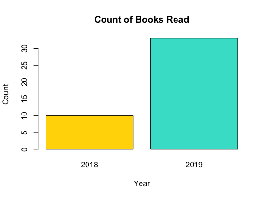
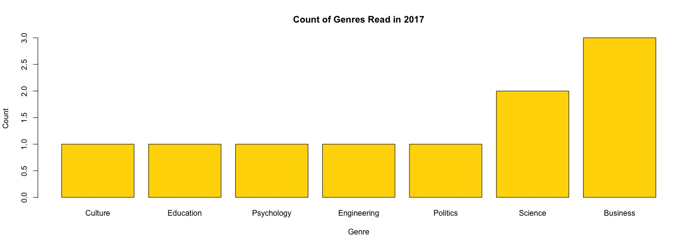
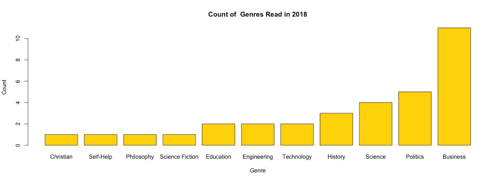
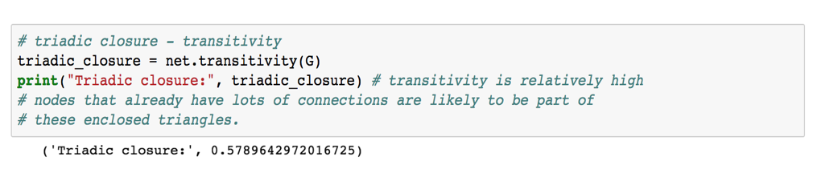
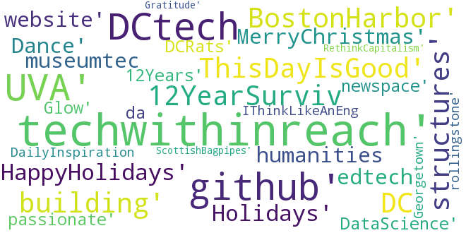

## BLOG
Currently, as we live through [the age of the algorithm](https://maisonneuve.org/article/2011/05/9/age-algorithm/), I experiment with data and its social impact. 

 

### A Year of Reading Reported through Data + Data-Driven Recommended Reading
At the beginning of 2018, I set a goal to start reading **books** more and listing what I am reading. Between November 2018 and February 2019, I expect to run some experiments with data using my **[reading list](https://margaretmf.github.io/readinglist)**.

When examining the plot, you can see that in 2017, I read 10 books and in 2018, I read 33.

What genres do I read? When did the books' authors write and publish?

It's interesting to see trends in the genres I tend to read the most! With [71+ books of interest for 2019](https://margaretmf.github.io/readinglist), there may exist ways to develop a prioritization system using genres I more likely read and Amazon product ratings. 

 

 

### Open Housing Data
After compiling hundreds of metrics, the [Joint Center for Housing Studies at Harvard University](http://www.jchs.harvard.edu/state-nations-housing-2018) reports that "despite some short-term progress since the recession" in affordable housing, "the long-term prognosis" for affordable housing "is grim," and it is "wiping out savings, increasing inequality and reducing the ability of workers to weather the next recession" ([6 Reasons Housing Is About To Become Even More Unaffordable](https://www.huffingtonpost.com/entry/housing-crisis-inequality-harvard-report_us_5b27c1f1e4b056b2263c621e)). Metrics exist on housing cost burdens, home sales, renters, mobility, and homeownership. 

As the Joint Center for Housing Studies sees this trend, open data lives on [homelessness in the US](https://www.hudexchange.info) online. With [Data for Democracy](http://datafordemocracy.org/), I'm starting to explore patterns in the data. As housing becomes less affordable, we have to understand the problem from all angles. Most people may not have time during their day to day activities to work with this public housing data; but given that the idea behind "open data" is that the data is public "oil" that anyone should use to create tools for the public good, by playing around with this data, we can generate thoughts on how to connect this to other housing studies and develop usable applications. 

As I bounce off of a strategic alignment project with [Compass](http://compassprobono.org/) and [Homeless Children's Playtime Project](https://www.playtimeproject.org/), which became a project while the DC Mayor created plans to move the homeless population to DC's [Conway Center](https://wtop.com/dc/2018/05/new-shelter-caters-to-families-job-training-as-dcs-largest-shelter-set-to-close/amp/), I've become more curious about the affordable housing crisis across the US.

What exists in the [HUD data source](https://www.hudexchange.info/resource/3031/pit-and-hic-data-since-2007/)? I think that to start experimenting with any data source, one must understand the following:
* datas that data were published
* fields in the data source
* field types in the data source
* population attributes
* population size

The [HUD raw data sets](https://www.hudexchange.info/resource/3031/pit-and-hic-data-since-2007/) "contain Point-in-Time (PIT) estimates and national PIT estimates of homelessness as well as national estimates of homelessness by state and estimates of chronic homelessness from 2007 - 2017. Estimates of homeless veterans are also included beginning in 2011. The accompanying Housing Inventory Count (HIC) data is available as well from 2007 - 2017.

By playing with the data, I've learned the following:
* 11 years of data is recorded (2007-2017)
* data fields: point-in-time estimates of housing inventory counts
* data field categories: Total Beds (ES, TH, SH) (13 fields), Emergency Shelter (ES) (12 fields), Transitional Housing (TH) (10 fields), Safe Housing (SH) (10 fields), Rapid Re-Housing (RRH) (10 fields), Permanent Supportive Housing (PSH) (10 fields), Other Permanent Housing (OPH) (11 fields)
* records: each states (55 total) state Continuum of Care programs

Over the next few weeks and months, a [Data for Democrocacy](http://datafordemocracy.org/) team will work on utilizing this data along with other open data sources and make it useful to citizens, governments, nonprofits, or businesses' corporate compliance or business social responsibility programs.

 

 

### Understanding Social Networks 
Psychologists, sociologists, and anthropologists are some of the first to study a branch of “mathematical” social science to understand social structures through [social network analysis]( http://moreno.ss.uci.edu/91.pdf). Since the early days, computational networks have been advanced. Facebook, a social media site that many people in my generation (generation y) grew up using, is a notorious example of a computational social network whose data representing the network is stored in a graph database, a database for data structures with nodes, properties of nodes, and relationships between nodes. An example of data from the Facebook workplace social network might include the following data:

See [Graph Databases 101]( https://www.cray.com/blog/graph-databases-101/) for more details on graph data structures.

Use cases of graph databases include the following:

(1)	[fraud detection]( https://neo4j.com/use-cases/fraud-detection/)- anti money laundering, ecommerce fraud, first-party bank fraud, insurance fraud, link analysis. Relationships between accounts, individuals, devices, and IP addresses are important in detecting financial crimes.
(2)	[knowledge graph]( https://neo4j.com/use-cases/knowledge-graph/)- asset management, content management, work flow processes. Relationships between digital assets are important in developing capabilities for searching products, services, content and knowledge catalogs.
(3)	[master data management]( https://neo4j.com/use-cases/master-data-management/)- cross reference business objects, data ownership, organizational hierarchies, master data. Relationships are important to gain a 360 degree view of master data and shared metadata.
(4)	[social media networks]( https://neo4j.com/use-cases/social-network/)- community cluster analysis, influencer analysis, sharing & collaboration, social recommendations, friend-of-friend recommendations. Relationships are important for understanding and leveraging social structures and social behaviors.

Because of the increasing demand for graph data structures, Amazon Redshift has introduced [Netptune]( https://aws.amazon.com/nosql/graph/) during an age when it is normal for multiple database types to be used in one application.

Querying from a postgres or mysql database is much different from querying from a graph database because the relationships are different. The relationships between nodes with properties are interesting though, so it’s fun to learn how to write graph database queries. Some [examples]( https://neo4j.com/graphgist/finding-influencers-in-a-social-network) are the following:

To query all users that have sent a message:
* MATCH path=(User)-[:SENT]->(Message) RETURN path

To find the influencers in the network and query the number of followers for users:
* MATCH (follower:User)-[:FOLLOWS]->(targetUser:User)-[:FOLLOWS]->(following:User) RETURN targetUser as targetUser COUNT(DISTINCT follower) as #ofFollowersOfTargetUser COUNT(DISTINCT following) as #targetUserIsFollowing 

To understand tweet behavior of active users:
* MATCH (p:User)-[:SENT]->(tweet:Message) RETURN p.id as activeUser, COUNT(tweet) as #ofTweetsMessaged

To remove bots (anyone that forwards a certain # of messages):
* MATCH (p:User)-[s:SENT]->(tweet:Message)-[retweet:FORWARD]->(tweet1:Message), (p:User)-[s2:SENT]->(tweet2:Message) WITH p, COUNT(DISTINCT tweets) as forwards, COUNT(DISTINCT tweet2) as messages WITH p, COUNT(DISTINCT tweet) as forwards,  COUNT(DISTINCT tweet2) as messages WHERE (forwards*1.00)/messages < 0.8 WITH p MATCH (p)-[s:SENT]->(tweet:Message)-[rt:FORWARD]->(tweet1:Message)<-[:SENT]-(p1:User) RETURN p1.id AS USER, COUNT(tweet) AS ‘Retweeted Messages’ ORDER BY COUNT(tweet) DESC LIMIT 15

In all of these queries, data is being queried where data is matching a specific relational pattern. The first node provided is an anchoring point, and then with that anchoring node, data are matched to those with the provided information on relationships. Like when querying from other databases, it’s possible to run mathematical functions like count, run subqueries, and return data. See more explanations about querying [here]( http://neo4j.com/docs/developer-manual/current/cypher/), and see more examples [here](https://neo4j.com/developer/?ref=home-2).

Now that I’ve shared some background interest in graph databases and social networks, I’ve decided to analyze networks within my text messages. In my text network analysis with [Python networkx](https://programminghistorian.org/lessons/exploring-and-analyzing-network-data-with-python), I’m not pulling data from a graph database in this case; rather I’m using structured nodes and edge data that I've created using information on who I've recently been texting with.
* Sometimes, I’m in group texts, so through the group text data, I’m able to visualize interesting social structures and confirm the interesting social structure with a relatively high transitivity score (0.58), which means that people are often triangulated.
* I can find brokers in the network who stand in between and connect people well, meaning that they can influence and give the network cohesion.
* This is a weighted, directed graph, so in visualizing larger arrows, I can see who is sending the most text messages to each other.

 

 

### Creating R Packages and Python Modules 
A few weeks ago [Meet the man behind the most important tool in data science](https://qz.com/1126615/the-story-of-the-most-important-tool-in-data-science/) was published in the New York Times on [Pandas, a Python library](http://pandas.pydata.org) that is used for some of the basic data manipulation work in data science. I resonated a lot with some of his story as expressed particularly through the sentence, "McKinney said it became clear to him by the middle of 2012 that Pandas was taking off. He didn’t take much time to bask in its success. The original code was 'inelegant,' he says, so he spent years improving the backbone of the tool, and trying to add features. McKinney attributes Pandas’s prominence, in large part, to his willingness to be vulnerable. 'With any creative project, but particularly with open source, it can be terrifying because you are opening yourself up to criticism from anybody,' he notes. The key is to welcome that criticism, he stressed."

Often, I've discovered over the past years that when analyzing or modeling data in the practice of data science and engineering, functions and methods must be written. With my company, I've been writing functions to turn [code that a biologist might write](https://nicercode.github.io/guides/functions/before.html) into [code that a data scientist might write](https://nicercode.github.io/guides/functions/after.html). Many of my functions depend on functions from other libraries like [dplyr](http://dplyr.tidyverse.org), but because analysis is more complicated, I enjoy the art and science of creating my own on top, making code progressively more elegant, and testing the applicability of them. While tools like dplyr and pandas exist already, sometimes more code has to be written, and developing the ability to write good code and contribute it to open source communities, even when criticism may be waiting, is fundamental to the practice of data science. Writing higher quality code and opening myself up to criticism along the way has supported transforming a longer process into one that is more enjoyable and involves more analytical problem solving.

To keep scripts clean, code readable and re-usable, and tasks efficient, I've also begun to teach myself how to create a package for functional code. With a package, I can incorporate the code I write more easily and make it easier for others to begin reading and using my code. Hilary Parker has written a [blogpost](https://hilaryparker.com/2014/04/29/writing-an-r-package-from-scratch/) on this, so I won't explain how to create a package in much detail. Adding functions to an R file that is part of a package, processing detailed and consistent documentation, and creating a git repo for the package is a step in the write direction for any data analyst or scientist as he/she begins his/her journey through "the age of the algorithm." I think that [AirBnB data scientists and engineers have discovered this also](https://medium.com/airbnb-engineering/using-r-packages-and-education-to-scale-data-science-at-airbnb-906faa58e12d) - "At AirBnB, we build packages to develop collaborative solutions to common problems, to standardize the visual presentation of our work, and to avoid reinventing the wheel. The goals of our educational efforts are to give all data scientists exposure to R and to the specific packages we use, and to provide opportunities for further learning to those who wish to deepen their skills."

As I start to move on to using Python more, it's great to learn from [those creating Python modules](http://www.blog.pythonlibrary.org/2012/07/08/python-201-creating-modules-and-packages/). Being aware of this will help as I work to package up data science code for a DataKind Corps project this spring.
 

 

### Machine Learning
I once read, "machine learning is to the 21st century what excel is to the 20th century." Machine learning and AI are not new concepts; people have been thinking about AI since early in the 20th century, but now with ubiquitous computing, easier access to data, and the potential for higher quality datasets, there's more potential for AI.

I'm interfacing with machine learning applications on a daily basis:
* when using LinkedIn, machine learning algorithms predict who I should connect with
* when searching on Google, machine learning algorithms classify me as a certain user type based on what I search
* when a large percentage of the population buy supplies from a store, the store might be deploy a machine learning algorithm to predict when a storm is coming 

How are choices about what machine learning algorithms are used? I've encountered some good visualizations recently, and there are [many](https://becominghuman.ai/cheat-sheets-for-ai-neural-networks-machine-learning-deep-learning-big-data-678c51b4b463).

To summarize two of them, I think it's helpful to break down learning problems into two things:
(1) unsupervised learning (there is no training data or ground truth) and supervised learning (there is training data or ground truth)
(2) regression and classification or clustering

Types of learning depend on the type of data being predicted and whether there are labeled data, to be used as ground truth, or not. If categorical data are being predicted, then the problem is a classification one; if there is labeled data, then classification algorithms can be used, but if there is no labeled data, then clustering algorithms can be used. If quantities are being predicted, then the problem is a regression one. And if structural components or dimensions within the dataset need to be examined, then dimensionality reduction mehtods are used. There are more choices that should be made, and these depend on number of samples, type of data, and number of features.

 

 

### What Have I Been Tweeting? 
I've been [tweeting](https://twitter.com/megmfurr) since February 2015 when I was in [UVA's Data Science Institute](https://dsi.virginia.edu). Recently, I've wanted to [analyze my twitter data in Python](https://github.com/margaretmf/Tweets/blob/master/%40megmfurr_tweets.ipynb).

Today, I started out by collecting and storing my twitter data.

First, I import [tweepy](http://www.tweepy.org), a Python module/library that supports gaining access to twitter data. I use a function defined by someone else online, shared on [git](https://gist.github.com/yanofsky/5436496), and pull the most recent data and am able to pull over 2,529 going back to February 22, 2015.

Some examples of the tweets in the csv file written out are the following: 
 
(1) "RT @dpatil: This is what I mean when I say data scientists are the new first responders -- new tech to help those in need and augment the t‰Û_"
 
(2) "RT @UVADSI: Data scientists are changing the nature of employment, and the meaning of employability @ftdata https://t.co/WFl2tKCWnG"
 
(3)"I published some #thoughts &amp; #questions "My Journey from History to Data Science‰Û https://t.co/Sh9rzqOONC #Humanity #Data #Tech #Kindness"
 
(4) "#Year2017 love life, and life will love you back"
 
(5) "RT @HillaryClinton: ‰ÛÏWay too many dreams die in the parking lots of banks. In America, if you can dream it, you should be able to do it.‰Û ‰ÛÓ‰Û_"
 
(6) "studying the humanities is necessary - we need both stem and humanities to be strong thinkers in 21st c. #highered http://t.co/64gyoZBCMR"
 

3 of the these are retweets, and 3 of them are tweets.
  

With all 2,546 datapoints, I have begun to answer some questions: 
* Over 2/3 of the tweets are retweets (1,649 are and 897 are not)
* 442 have something to do with #DataScience, which is roughly 3/4 of them
* Top words or phrases include the following: #DCTech, [UVA](http://www.virginia.edu), #github, [@BecomingDataSci](https://twitter.com/BecomingDataSci), creating, future, [@jhagel](https://twitter.com/jhagel), #techwithinreach. Based on this, my one can infer that with an associon to the University of Virginia, I have interest in technology in DC, a leading Data Scientist, creating the future, and a leading management consultant. 
* 80 of the words are hashtags, and some of them are visualized below through a [wordcloud](https://amueller.github.io/word_cloud/index.html).

 

 

### Where Are the Metro Stations?
With [Compass](http://compassprobono.org), I'm working on another strategic alignment project to support an adjustment in [Homeless Children's Playtime Project's](https://www.playtimeproject.org) services, operations, and locations, as they move to new sites. One way I'm supporting the project is by collecting and analyzing data in a way that informs the organiation as the nonprofit make adjustments. 

Today,to support Homeless Children's Playtime Project, I started collecting data on the locations of homeless shelters, homeless services, metro stations, and bus stations. Most of the data I was collecting comes from [DC Open Data](http://opendata.dc.gov) but metro data came from [Ben Balter's dc-maps git repo](https://github.com/benbalter/dc-maps), so instead of just downloading the file with Lat and Lon, I enjoyed working on manipulating some of the data.

After saving the json file linked to the maps of [metro station entrances](https://github.com/benbalter/dc-maps/blob/master/maps/metro-station-entrances-district.geojson), I read the data and parsed out the Station Name, the Line, the Latitude, and the Longitude. I then save the parsed out data in a dataframe and read that data file out. There are similar blogposts on this topic that explore reading json files in more depth [here](http://zevross.com/blog/2015/02/12/using-r-to-download-and-parse-json-an-example-using-data-from-an-open-data-portal/).

Now our team has [data](https://github.com/margaretmf/DCMetros) to answer the question, "where are the DC metro stations?".

 
