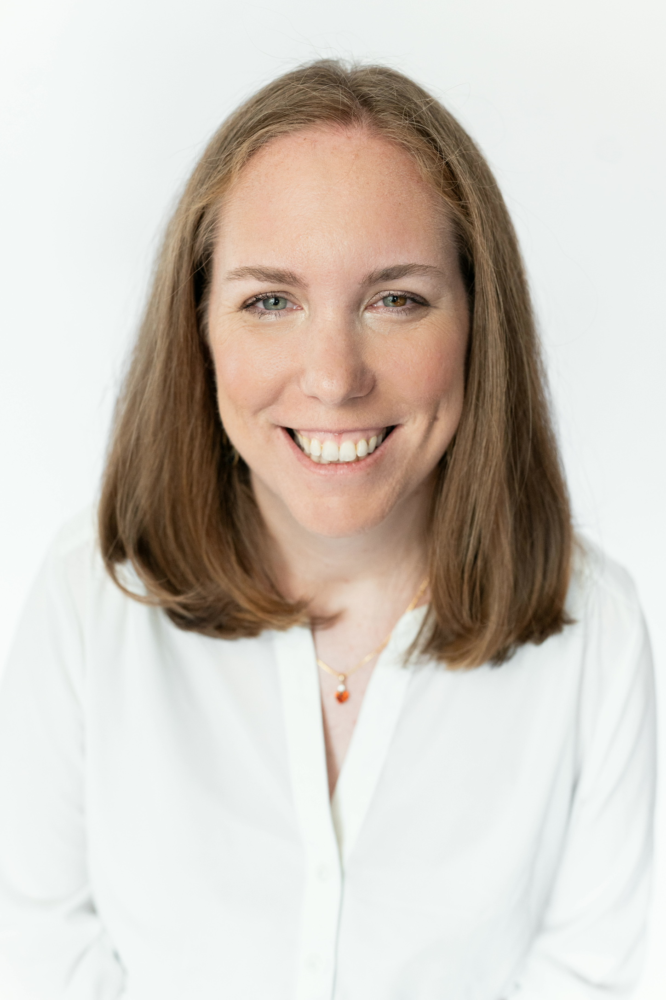

 

## Hello! Welcome to Margaret Furr's site. 

## Short Biography ##
I am **Margaret Furr**, a graduate of the University of Virginia. Currently, I am preparing to work as an **Incoming Data Analyst** with **[Richmond National](https://www.richmondnational.com/)**, an excess and surplus insurance business. I am excited to repivot into data analytics and technology after working as a **Literacy Tutor** with **[The Literacy Lab](https://theliteracylab.org/)**, as part of a second **AmeriCorps service year**, because The Literacy Lab's program is discontinuing. While I am not tutoring, I have worked as a **Substitute Teacher Assistant** with **[Horizons Hampton Roads](https://www.horizonshamptonroads.org)** and as a **Glee Club and Cabin Counselor** with **[Camp Nakanawa](https://campnakanawa.org/)**. Previously, I worked as a **Data Analyst** with **[EVERFI](https://everfi.com/)**, an educational technology company, which provides courses that help students to become financially and digitally literate, engage civically, and develop healthy relationships. I then worked as a **Freelance Researcher** for **the social sector**.

I have enjoyed working as a **pro bono strategic alignment consultant** for **[The Welders](https://www.thewelders.org/)**, **[Homeless Children's Playtime Project](https://www.playtimeproject.org)**, and **[Jubilee Jumpstart](http://www.jubileejumpstart.org)** through **[Compass](http://compassprobono.org)** to revitalize the DC community, and I have worked as a **proposal reviewer**, **project manager**, **data ambassador** and **data analyst** with **[DataKind](http://www.datakind.org)**. It has been fun to interview people experiencing homelessness with **[Design for the Homeless](https://www.designforthehomeless.org/)**.

The values that Thomas Jefferson and other founders shared in the Declaration of Independence and the active pursuit of Life, Liberty, and Happiness inspire me. 

Every day I seek to learn something new to stay alive. It's amazing how all humanity works together for good in small ways and big ways. I am grateful to "push the boundary of what's possible', hopefully 'in the name of the greater good" (Thomas Jefferson). It's great to cultivate latent talents and play around like little kids and amateurs, and I seek to do work scientifically, applying best practices.

I am exploring how to sketch and how to use visual arts to share history and culture, and also use visual sketching to support the field of engineering.

I love working on photography of light in the darkness, American flags, leaves, windows, doors, every day objects in nature, and homes. I also love developing an understanding of signs and symbols from different languages, and I am working on a series of sketches of symbols.

With a love for writing and reading, I have been continuing the work on the American Credo project that students started in 11th grade at Norfolk Academy. Continuing the American Credo project consists of writing creatively, examining beliefs, understanding the country, and creating art. My true passion is writing about engineering, STEAM, and educational content, and I dream of writing at least one book on how people with liberal arts degrees work in the real world or entrepreneuriship. I love children's books and how people turn them into films. My other true passion is connecting to people through authentic conversations and eye-to-eye level meetings. I am working to understand all the government leaders by reading about them, and I am interested in how poetry supports coding and coding supports poetry. Finally, I am researching themes in books like oneness, unity, faith in politics, women's role in elections, the story of America, black lives' roles, republican-democratic party dynamics, and what the American States are. I also love exploring how people create music.

Little children are healing, organizing things gives me life, and expressing good cheer in the Post Office and the Fed Ex is fun.

I love world cultures, includng African, Arab, Chinese, Spanish, and Native cultures. 

Currently, I am studying the Spanish version of the Bible. I am revitalizing an appreciation for the beautiful language. I am listening to music and the radio in Spanish every day.

I believe that the stories that families share about ancestors are the most spiritual elements of who people are. I believe that details matter. I believe in respecting the secrets that people share. 

It is interesting how movements start from the ground-up. I am interested in the world cultures, narratives, and archetypes around engineering as well as STEAM education. 

Finally, as a student at the University of Virginia and the University of Glasgow, I used to row. I used to wake up by 5am and drive team members to practice in Charlottesville. I'd love to get back into shape and row with a team. Rowing on a river is the best thing to appreciate being a team member, to commit to goals, to express diligence, intelligence, a sense of unity and oneness, and strength, and to love nature - the water, the trees, the birds.

Words that inspire me from Daniel J. Levitin's book, [The Organized Mind: Thinking Straight in the Age of Information Overload](https://www.amazon.com/Organized-Mind-Thinking-Straight-Information/dp/0147516315), is "Where art, technology, or science alone cannot solve problems, the combination of the three is perhaps the most powerful of all." 

**How Do I Improve Myself?**
* Daily, I work to express gratitude for people and appreciate the latent talents I see in people.
* Daily, I work to explore beliefs and believing.
* Daily, I work to listen to the feedback I receive from people.
* Daily, I work to know how I can better work with people.
* Daily, I work to know how I can set healthy boundaries with people.
* Daily, I work to forgive people who have hurt me.
* Daily, I work to move outside of my comfort zone in some way.
* Daily, I work to commit to people who I already know.
* Daily, I work to appreciate and expand upon the work already completed.
* Daily, I work to give credit to people.
* Daily, I work to let go of the past.
* Daily, I work to love someone better.
* Daily, I work to give up personal ambition.
* Daily, I work to listen to the needs of others.
* Daily, I work to appreciate how Christian Science inspires my work, all Christian faiths, other religions, and the work done in the medical world.
* Daily, I work to appreciate my family.
* Daily, I work to appreciate the names of people I meet.
* Daily, I believe that people from the ground floor can share ideas that support an organization grow, improve, and move forward.
* Daily, I am grateful for democracy and democratization.
  
 

## Skills

**Data Analytics**: data-driven storytelling, analytical dashboard development, data wrangling and management framework development, advanced statistical modeling (regression, clustering, principal components, association rules, random forest), geospatial analysis, survey analysis; familiar with machine learning concepts (neural networks, training and testing datasets, cross-fold validation), and social network analysis

**Systems Practice, Design Research, and Mission-Driven Consulting**: systems analysis, systems practice and design for social justice, ethnographic interviewing and focus groups, systems mapping and systems narrative development, requirements facilitation, user story and requirements writing, chatbot systems design; nonprofit strategic alignment 

**Writing:** white paper writing, blog writing, user story writing, historical writing

**Project Management**: project proposal review, project scope analysis, project roadmapping, and project progress reporting

**Software and Programming Languages:** R, Python, SQL, ArcGIS, QGIS, Periscope, Anaconda, Weka, Git/Github, Jira, Trello; familiar with Tableau, MapReduce, Java, AWS, SAS, Ruby on Rails

**Soft:** cross-functional teamwork, international teamwork; familiar with Spanish language and gaining exposure to India

**Training:** ISO 9001 Quality Management Systems, SCRUMstudy Scrum Master, Human-Centric Leading, Systems Practice, Civil Dialogues

**Educating:** tutoring

**Media Management:** Twitter, Instagram; Photography, Videography

 

## Interests

**World Affairs, Organizations and Cultures:** communities, world affairs, learning organizations, theory of emergence, network science, international cultures, creative process, democratic process, community building

**Technology/Information:** algorithmic biases and prejudices, neural patterns, patterns in data, flow-based programming, technological and social change, technological ecosystems, interactions between technology and humans, participatory design, public infrastructure, effective information flow, data integration, technology policy and governance

**Social Impact:** impact investing, sustainable development goals, inclusive economic growth, double bottom line

**Spirituality:** collective consciousness, natural systems, meditation and expressive practice, roots of spoken languages

 

