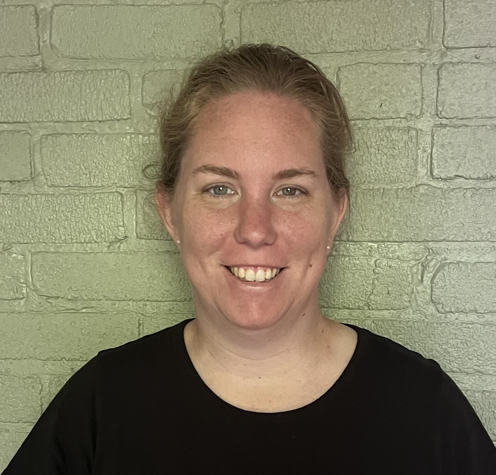

 

## Hello! Welcome to Margaret Furr's site. 

## Short Biography, **La Biografía** ##
I am **Margaret Furr**, a graduate of the University of Virginia. Currently, I am exploring next steps in my career after working as a **Literacy Tutor** with **[The Literacy Lab](https://theliteracylab.org/)**, as part of a second **AmeriCorps service year**, because The Literacy Lab's program is discontinuing. While I am not tutoring, I have worked as a **Substitute Teacher Assistant** with **[Horizons Hampton Roads](https://www.horizonshamptonroads.org)** and as a **Glee Club and Cabin Counselor** with **[Camp Nakanawa](https://campnakanawa.org/)**. Previously, I worked as a **Data Analyst** with **[EVERFI](https://everfi.com/)**, an educational technology company, which provides courses that help students to become financially and digitally literate, engage civically, and develop healthy relationships. I then worked as a **freelance researcher** for **the social sector**.

Me llamo **Margarita Furr**, y estoy una graduada de la Universidad de Virginia. Actualmente, estory explorando próximos pasos en mi carrera despues de trabajando como una Tutora de Alfabetización con **[The Literacy Lab](https://theliteracylab.org/)**, como parte de un segundo **Año de Servicio de AmeriCorps**, porque el programa del laboratorio de alfabetización está discontinuado. Mientras no doy clases particulares, he trabajado como **Asistente de maestro sustituto** con **[Horizons Hampton Roads](https://www.horizonshamptonroads.org)** y como **Glee Club y Consejero de cabina** con **[Campamento Nakanawa](https://campnakanawa.org/)**. Previamente, trabajó como una **Analista de Datos** con **[EVERFI](https://everfi.com/)**, una empresa de tecnología educativa, que proporciona contenido que ayuda los estudiantes se alfabetizan en finanzas y herramientas digitales, participar cívicamente, y desarrollar relaciones saludables. Entonces, trabajó como una investigadora independiente para **el sector social**

I have enjoyed working as a **pro bono strategic alignment consultant** for **[The Welders](https://www.thewelders.org/)**, **[Homeless Children's Playtime Project](https://www.playtimeproject.org)**, and **[Jubilee Jumpstart](http://www.jubileejumpstart.org)** through **[Compass](http://compassprobono.org)** to revitalize the DC community, and I have worked as a **proposal reviewer**, **project manager**, **data ambassador** and **data analyst** with **[DataKind](http://www.datakind.org)**. It has been fun to interview people experiencing homelessness with **[Design for the Homeless](https://www.designforthehomeless.org/)**.

He disfrutado trabajando como una **consultora de alineación estratégica** para **[The Welders](https://www.thewelders.org/)**, **[Homeless Children's Playtime Project](https://www.playtimeproject.org)**, y **[Jubilee Jumpstart](http://www.jubileejumpstart.org)** por **[Compass](http://compassprobono.org)** para revitalizar la comunidad de Washington, DC. También, he trabajado como una **revisor de propuestas**, **gerente de proyecto**, **embajadora de datos**, y **analista de datos** con **[DataKind](http://www.datakind.org)**. Ha sido divertido para entrevistar la gente experimentando la falta de vivienda con **[Design for the Homeless](https://www.designforthehomeless.org/)**.

The values that Thomas Jefferson and other founders shared in the Declaration of Independence and the active pursuit of Life, Liberty, and Happiness inspire me. 

**Los valores que Thomas Jefferson y otros descrubridores compartieron en la Declaración de Independiencia y la búsqueda de La Vida, La Libertad, y La Felicidad me inspiran.**

Every day I seek to learn something new to stay alive. It's amazing how all humanity works together for good in small ways and big ways. I am grateful to "push the boundary of what's possible', hopefully 'in the name of the greater good" (Thomas Jefferson). It's great to cultivate latent talents and play around like little kids and amateurs, and I seek to do work scientifically, applying best practices.

**Todos los días, busco aprender alguna cosa nueva para vivir. Es asombrosa que toda de la humanidad trabaja juntos para bien en caminos pequeños y caminos grandes. Tengo gratitude para "la emprendedora de los límites de que posible", con esperanza que es "en el nombre de la mayor bien" (Thomas Jefferson). Es excelente cultivar talentos latentes y jugar como niñas pequeñas, y busco trabajar científicamente, aplicando mejores prácticas.**

I am exploring how to sketch and how to use visual arts to share history and culture, and also use visual sketching to support the field of engineering.

**Explorando que dibujar y que usar las artes visuales para expresar historia y cultura. Tambien, explorando que usar dibujando para apoyar el campo de Ingenieria.**

I love working on photography of light in the darkness, American flags, leaves, windows, doors, every day objects in nature, and homes. I also love developing an understanding of signs and symbols from different languages, and I am working on a series of sketches of symbols.

**Me amo trabajando en fotografia de la luz en la oscuridad, la bandera de los Estados Unidos, las hojas, las ventanas, las puertas, los objetos cotidianos en la naturaleza, y las cosas.**

With a love for writing and reading, I have been continuing the work on the American Credo project that students started in 11th grade at Norfolk Academy. Continuing the American Credo project consists of writing creatively, examining beliefs, understanding the country, and creating art. My true passion is writing about engineering, STEAM, and educational content, and I dream of writing at least one book on how people with liberal arts degrees work in the real world or spiritual entrepreneuriship. I love children's books and how people turn them into films. My other true passion is connecting to people through authentic conversations and eye-to-eye level meetings. I am working to understand all the government leaders by reading about them, and I am interested in how poetry supports coding and coding supports poetry. Finally, I am researching themes in books like oneness, unity, faith in politics, women's role in elections, the story of America, black lives' roles, republican-democratic party dynamics, and what the American States are. I also love exploring how people create music.

**Con amor por escribiendo y leyendo, ha estado continuando el trabaja en el proyecto del credo Americano que los estudiantes comenzó en el 11° grado a la academia de Norfolk. El proyecto consiste en escribiendo creativamente, examinando creencias, entendiendo el país y el mundo, y creando arte. Mi pasión verdadera es la escritura sobe la Ingenieria, STEAM, y contenido pedagógico; y sueño con escribir un libro sobre cómo trabajan las personas con títulos en artes liberales en el mundo o emprendimiento espiritual. Me encantan los libros para niños y cómo la gente los convierte en películas. Mi otra verdadera pasión es conectarme con las personas a través de conversaciones auténticas y reuniones cara a cara. Estoy trabajando para comprender a todos los líderes del gobierno leyendo sobre ellos, y estoy interesado en cómo la poesía apoya la codificación y la codificación apoya la poesía. Finalmente, estoy investigando temas en libros como la unidad, la unidad, la fe en la política, el papel de las mujeres en las elecciones, la historia de Estados Unidos, los roles de las vidas de los negros, la dinámica de los partidos republicano-democráticos y lo que son los Estados estadounidenses. También me encanta explorar cómo la gente crea música.**

Little children are healing, organizing things gives me life, and expressing good cheer in the Post Office and the Fed Ex is fun.

**Niños pequeños y niñas son cicatrización, organizando es mi pasión, y expresando buen animo en la Oficina Correo, en el edificio de Federal Rápida, y en las calles construcciónes mantiene la gente vivaz, humilde, y cantando por dentro.** 

I love world cultures, includng African, Arab, Chinese, Spanish, and Native cultures. 

**Me amo muchas de las culturas del mundo, incluyendo Africano, Árabes, Chino, Español, y Nativa.**

Currently, I am studying the Spanish version of the Bible. I am revitalizing an appreciation for the beautiful language. I am listening to music and the radio in Spanish every day.

**Actualmente, estudiando la versión de La Biblia en Español. Estoy revitalizando una apreciación por el idioma muy bonito. Escuchando a la música y la radio en Español todos de los días.**

I believe that the stories that families share about ancestors are the most spiritual elements of who people are. I believe that details matter. I believe in respecting the secrets that people share. 

It is interesting how movements start from the ground-up. I am interested in the world cultures, narratives, and archetypes around engineering as well as STEAM education. The books for children by Jean Craighead George capture creatively the historic culture around engineering and nature.

**Creo que los cuentos que familias contan sobre sus antepasados son los elementos más espirituales de quien la gente están. Creo que los detalles importan. Es importantae respitar los misterios que la gente comparte.**

**Estoy interesada en como los movimientos comienzan desde el principio. Estoy interesada en las culturas, las narrativas, y los arquetipos sobre la ingeniería así como STEAM educación. Los libros para las niñas por Jean Craighead George capturan creativamente la cultura histórica alrededor la ingeniería y la naturaleza.**

Finally, as a student at the University of Virginia and the University of Glasgow, I used to row. I used to wake up by 5am and drive team members to practice in Charlottesville. I'd love to get back into shape and row with a team. Rowing on a river is the best thing to appreciate being a team member, to commit to goals, to express diligence, intelligence, a sense of unity and oneness, and strength, and to love nature - the water, the trees, the birds.

**Finalmente, como un estudiante de las Universidad de Virginia y la Universidad de Glasgow, remé. Desperté antes de ante a las 5 am y condujo miembros del equipo para practicar en Charlottesville, Virginia y en Glasgow, Scotland. Me encantaría volver a estar en forma y remar con un equip. Remando en a río es la cosa mejor para agradecer ser una miembra de un equipo, cometer a metas, expresar diligencia, intelligencia, un sentido de unidad, y fuerza, and amar naturaleza - la agua, los árboles, y los aves.**

Words that inspire me from Daniel J. Levitin's book, [The Organized Mind: Thinking Straight in the Age of Information Overload](https://www.amazon.com/Organized-Mind-Thinking-Straight-Information/dp/0147516315), is "Where art, technology, or science alone cannot solve problems, the combination of the three is perhaps the most powerful of all." 

**Las palabras que me inspiran que el libro por Daniel J. Levitin, [La Mente Organizada](https://www.amazon.com/Resumen-Completo-Organizada-Organized-Levitin/dp/B08Y1MFQ7C) son "Donde el arte, la tecnologia, o la ciencia solamente no puede resolver problemas, la combinación de toda los tres es la mas poderosa de todas."**

**How Do I Improve Myself?**
* Daily, I work to express gratitude for people and appreciate the latent talents I see in people.
**Diaria, trabajo para expresar gratitud por la gente y agradezco los talentos latentos que veo en la gente.**

* Daily, I work to explore beliefs and believing.
**Diaria, trabajo para explorar las creencias y creyendo.**

* Daily, I work to listen to the feedback I receive from people.
**Diaria, trabajo para escuchar a realimentación que recibo de le gente.**

* Daily, I work to know how I can better work with people.
**Diaria, trabajo para conocer como puedo mejorar trabajar con la gente.**

* Daily, I work to know how I can set healthy boundaries with people.
**Diaria, trabajo para conocer como establecer límites con la gente.**

* Daily, I work to forgive people who have hurt me.
**Diaria, trabajo para perdonar la gene que me has lastimado.**

* Daily, I work to move outside of my comfort zone in some way.
**Diaria, trabajo para mover fuera de mi zona de confort.**

* Daily, I work to commit to people who I already know.
**Diaria, trabajo para comprometerse con la gente que conozco.**

* Daily, I work to appreciate and expand upon the work already completed.
**Diaria, trabajo para agredecer y expandir sobre el trabajo ya terminado.**

* Daily, I work to give credit to people.
**Diaria, trabajo para dar crédito a la gente.**

* Daily, I work to let go of the past.
**Diaria, trabajo para deja ir el pasado.**

* Daily, I work to love someone better.
**Diaria, trabajo para amar a alguien mejor.**

* Daily, I work to give up personal ambition.
**Diaria, trabajo para renunciar a la ambición personal.**

* Daily, I work to listen to the needs of others.
**Diaria, trabajo para eschuchar a las necesidades de las demás.**

* Daily, I work to appreciate how Christian Science inspires my work, all Christian faiths, other religions, and the work done in the medical world.
**Diaria, trabajo para agradezco que la Sciencia Cristiana inspira mi trabajo, todas las religiones, y el trabajo hecho en el mundo medico.**

* Daily, I work to appreciate my family.
**Diaria, trabajo para agredezco mi familia.**

* Daily, I work to learn an English vocabulary word and a Spanish vocabulary word.
**Diaria, trabajo para aprender una palabra en inglés y una palabra en expañol.**

* Daily, I work to appreciate the names of people I meet.
**Diaria, trabajo para agradezco los nombres de la gente que me reúno.**

* Daily, I learn not to retaliate when hurt.
**Diaria, trabajo para no tomar represalias cuando está herida.**

* Daily, I believe that people from the ground floor can share ideas that support an organization grow, improve, move forward.
**Diaria, trabajo para creer que la gente de planta baja puede compartir ideas que apoyar una organización crecer, mejorar, y avanzar.**

* Daily, I am grateful for democracy and democratization.
**Diaria, trabajo para democracia y la democratización.**

 

## Skills

**Data Analytics**: data-driven storytelling, analytical dashboard development, data wrangling and management framework development, advanced statistical modeling (regression, clustering, principal components, association rules, random forest), geospatial analysis, survey analysis; familiar with machine learning concepts (neural networks, training and testing datasets, cross-fold validation), and social network analysis

**Systems Practice, Design Research, and Mission-Driven Consulting**: systems analysis, systems practice and design for social justice, ethnographic interviewing and focus groups, systems mapping and systems narrative development, requirements facilitation, user story and requirements writing, chatbot systems design; nonprofit strategic alignment 

**Writing:** white paper writing, blog writing, user story writing, historical writing

**Project Management**: project proposal review, project scope analysis, project roadmapping, and project progress reporting

**Software and Programming Languages:** R, Python, SQL, ArcGIS, QGIS, Periscope, Anaconda, Weka, Git/Github, Jira, Trello; familiar with Tableau, MapReduce, Java, AWS, SAS, Ruby on Rails

**Soft:** cross-functional teamwork, international teamwork; familiar with Spanish language and gaining exposure to India

**Training:** ISO 9001 Quality Management Systems, SCRUMstudy Scrum Master, Human-Centric Leading, Systems Practice, Civil Dialogues

**Educating:** tutoring

**Media Management:** Twitter, Instagram; Photography, Videography

 

## Interests

**World Affairs, Organizations and Cultures:** communities, world affairs, learning organizations, theory of emergence, network science, international cultures, creative process, democratic process, community building

**Technology/Information:** algorithmic biases and prejudices, neural patterns, patterns in data, flow-based programming, technological and social change, technological ecosystems, interactions between technology and humans, participatory design, public infrastructure, effective information flow, data integration, technology policy and governance

**Social Impact:** impact investing, sustainable development goals, inclusive economic growth, double bottom line

**Spirituality:** collective consciousness, natural systems, meditation and expressive practice, roots of spoken languages

 

