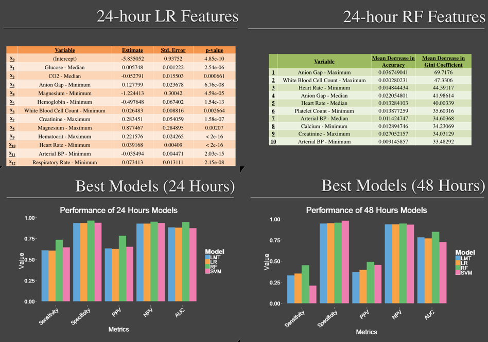
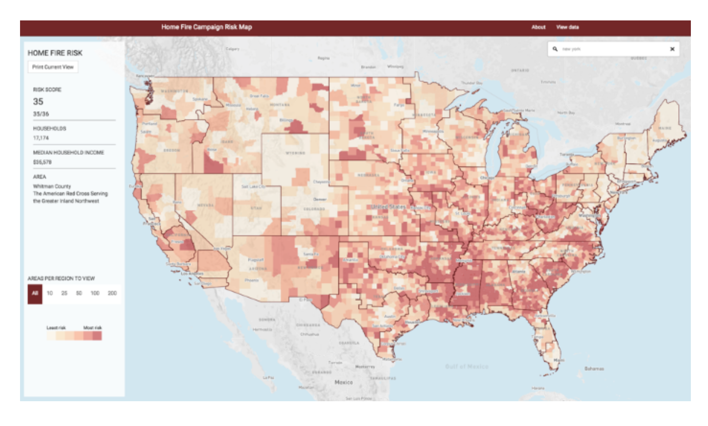
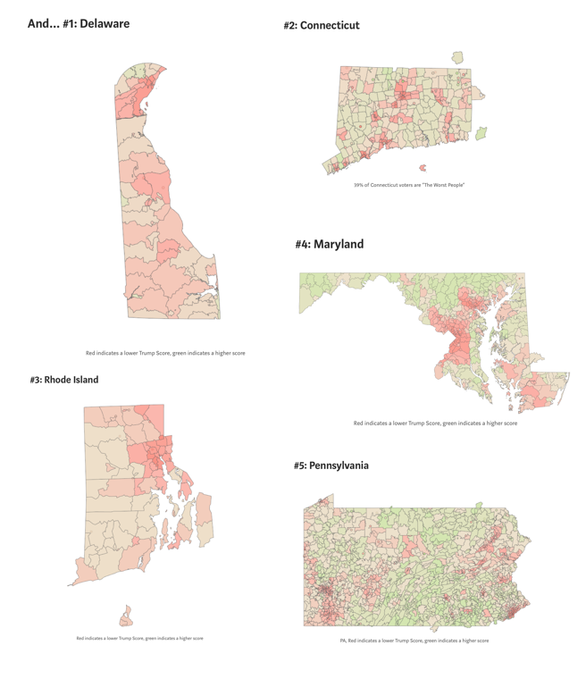

 

## UVA Health Care System - Predicting Severe Sepsis

I worked on a team of 4 using data coming from UVA's Health Care System. Severe sepsis is the leading cause of deaths in adult ICUs. Severe sepsis is defined as a syndrome of organ dysfunction in the setting of infection (blood culture acquisition) and high lactate (>4 mmol/L). Early intervention can lead to better patient outcomes, so we worked to predict which patients would experience severe sepsis using 4 modeling approaches: (1) logistic regression, (2) support vector machines, (3) logistic model trees, and (4) random forest. These models can be applied in a clinical setting to support helping patients that are at greatest risk.  

I worked heavily on the logistic regression and random forest models after splitting the data into a control cohort and a target cohort and working on feature selection. I also supported applying a cross-validation on the models and evaluation approaches with 5 metrics: Sensitivity, specificity, PPV, NPV, and AUC. Some of my code for the project is [here](https://github.com/margaretmf/Classwork/blob/master/ControlGroup.R), where I create the control group, and [here](https://github.com/margaretmf/Classwork/blob/master/LMT.R), where I work on the logistic model tree. 

[See full ppt presentation](http://maria-antoniak.github.io/predicting-severe-sepsis.pdf).

  

## DataKind DC and American Red Cross Project - Home Fire Risk Modeling

I worked on a team of 50 volunteers using (1) open data from the American Community Survey and the American Housing Survey, (2) data aggregated and collected by the Enigma smoke-signals project, (3) data from the National Fire Incident Reporting System, and (4) Red Cross home fire preparedness and response data, to help build this tool for identifying high-risk areas in cities and towns across the United States. To date, over 400,000 alarms have already been installed in over 175,000 households. This [tool](http://home-fire-risk.github.io/smoke_alarm_map/) will ensure that the remainder of the organization’s pledged 2.5M smoke alarms are installed in the communities where they are needed the most.

I specifically worked on the [Homefire per Tract Risk Indicator](https://github.com/home-fire-risk/smoke_alarm_models/blob/master/model_2c_ind_RC_response/code/RC_homefire_per_tract_risk_indicator.R).

 

## Clarity Campaign Labs - Free Trump Scoring for National Voters in 5 Primary States

I worked to use national voter file data as well as Purpose Labs' free trump score critiera to develop maps for 5 primary states. This is a [blog](https://medium.com/@joshhendler/what-does-donald-trump-think-of-tuesday-s-primary-states-97c8baf7505d) that Purpose Labs wrote on the final results.

 

## UVA Data Mining Class - Crime Modeling

Crime is a big issue in Chicago, and there is open data on where crime occurs in Chicago. There is also other open spatial data.

In statistics, kernel density estimation (KDE) is a non-parametric way to estimate the probability density function of a random variable, like crime and where crime occurs. Kernel density estimation is a fundamental data smoothing problem where inferences about the population are made, based on a finite data sample.

I used KDE to understand hotspots of and forecast crime in Chicago. For this, h (the smoothing paraemter) = 200m. When h is larger, there's more bias, and when h is smaller, there's more variance. Using the best h, then we can build a model for predicting crime based on other spatial factors like liquor licensed locations and use AUC to evaluate the model across time.

See some of my code [here](https://github.com/margaretmf/Crime-Data-Project/blob/master/CrimePrediction.R).

                                                          
  

 

## Data for Democracy - Women's Marches around the States

In January 2017, after Trump became the President of the US, women came to DC to march and women marched in other cities around the states. I became interested in patterns of who marched, where people marched, and the sentiments of the marchers. I started a data project by creating a map to visualize where women marched. There is much more to work on here, as I've done further research on [women's issues and the status of women](https://statusofwomendata.org). [Here](https://github.com/margaretmf/DataForDemocracy-DataExploration/tree/master/CrowdEstimatesExploration) is where I began work to explore march-related data.

 

                                                          
                  
                                                        

