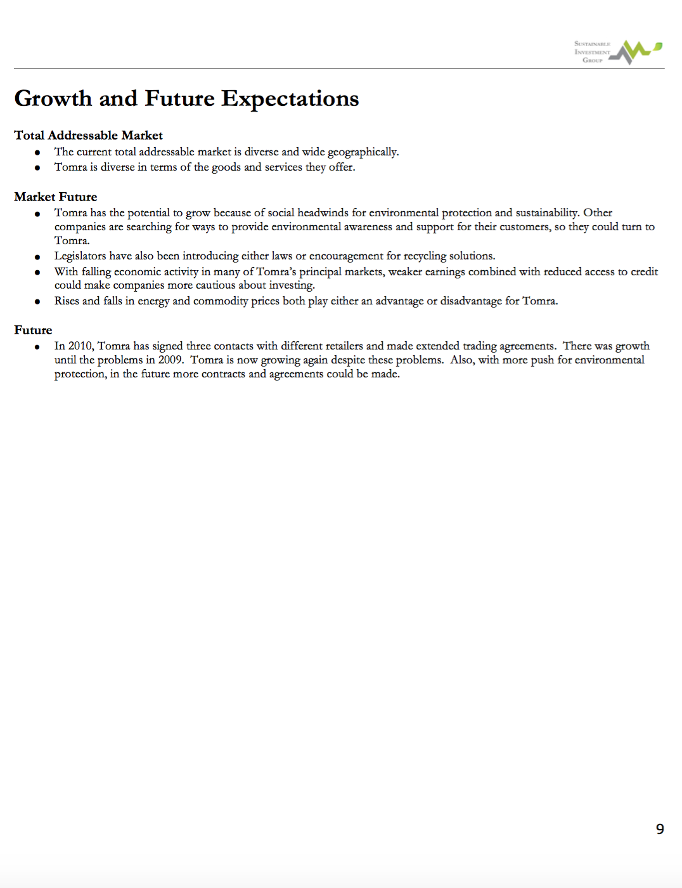

 

## UVA Health Care System - Predicting Severe Sepsis

I worked on a team of 4 using data coming from UVA's Health Care System. Severe sepsis is the leading cause of deaths in adult ICUs. Severe sepsis is defined as a syndrome of organ dysfunction in the setting of infection (blood culture acquisition) and high lactate (>4 mmol/L). Early intervention can lead to better patient outcomes, so we worked to predict which patients would experience severe sepsis using 4 modeling approaches: 

 
(1) logistic regression
(2) support vector machines
(3) logistic model trees
and (4) random forest. 
  

These models can be applied in a clinical setting to support helping patients that are at greatest risk.  

I worked heavily on the logistic regression and random forest models after splitting the data into a control cohort and a target cohort and working on feature selection. I also supported applying a cross-validation on the models and evaluation approaches with 5 metrics: Sensitivity, specificity, PPV, NPV, and AUC. Some of my code for the project is [here](https://github.com/margaretmf/Classwork/blob/master/ControlGroup.R), where I create the control group, and [here](https://github.com/margaretmf/Classwork/blob/master/LMT.R), where I work on the logistic model tree. 

Download full ppt presentation [here](http://margaretmf.github.io/predicting-severe-sepsis.pptx).

  

## DataKind DC and American Red Cross Project - Home Fire Risk Modeling

I worked on a team of 50 volunteers using 

  
(1) open data from the American Community Survey and the American Housing Survey,
(2) data aggregated and collected by the Enigma smoke-signals project,
(3) data from the National Fire Incident Reporting System,
and (4) Red Cross home fire preparedness and response data, to help build this tool for identifying high-risk areas in cities and towns across the United States. 
 

To date, over 400,000 alarms have already been installed in over 175,000 households. This [tool](http://home-fire-risk.github.io/smoke_alarm_map/) will ensure that the remainder of the organization’s pledged 2.5M smoke alarms are installed in the communities where they are needed the most. As of March 2017, the smoke detector campaign has saved over 200 documented lives.

I specifically worked on the [Homefire per Tract Risk Indicator](https://github.com/home-fire-risk/smoke_alarm_models/blob/master/model_2c_ind_RC_response/code/RC_homefire_per_tract_risk_indicator.R).

 

## Clarity Campaign Labs - Free Trump Scoring for National Voters in 5 Primary States

In the spring of 2016, I spent time doing analytical work to support understanding gubernatorial and senatorial candidates and their political platforms. Most of the research done included supporting all stages of the polling process and extracting data on what voters think of candidates and issues through SQL servers from DNC, TargetSmart, and other clients.

One of my final projects was a little different given the nature of the 2016 presidential primaries. I worked to use the same national voter file data as well as Purpose Labs' free trump score critiera to calculate how Trump views voters, with how he views them being on a scale between "very good" and "very bad" and with criteria coming from ways Trump talked during the debates. Using the scores I calculated, I developed maps for 5 primary states. This is a [blog](https://medium.com/@joshhendler/what-does-donald-trump-think-of-tuesday-s-primary-states-97c8baf7505d) that Purpose Labs wrote on the final results.

 

## UVA Data Mining Class - Crime Modeling

Crime is an issue in Chicago, and there is open data on where crime occurs in Chicago. There is also other open spatial data.

In statistics, kernel density estimation (KDE) is a non-parametric way to estimate the probability density function of a random variable, like crime and where crime occurs. Kernel density estimation is a fundamental data smoothing problem where inferences about the population are made, based on a finite data sample.

I used KDE to understand hotspots of and forecast crime in Chicago. For this, h (the smoothing paraemter) = 200m. When h is larger, there's more bias, and when h is smaller, there's more variance. Using the best h, then we can build a model for predicting crime based on other spatial factors like liquor licensed locations and use AUC to evaluate the model across time.

See some of my code [here](https://github.com/margaretmf/Crime-Data-Project/blob/master/CrimePrediction.R).

                                                          
  
 

# UVA Computer Science Class - Urbanization in G20 Members

The World Bank has as Development Indicators database from 2010. Using Python and SQL, I was able with a team to answer 4 questions: 

 
(1) how does urbanization increase or decrease with economic development? 
(2) how does urbanization increase or decrease with labor structure? 
(3) how does urbanization increase or decrease with power consumption? 
(4) how does urbanization increase or decrease with trade openness?
 

To answer such questions, I created tables using data from the database using a sql connector in [Python](https://github.com/margaretmf/Classwork/blob/master/G20.py). Conclusions from the analysis are that 

 
(1) high urbanization shows stronger economic development, 
(2) high urbanization leads to a labor structure heavy in service employment, 
(3) high urbanization shows more power usage, and 
(4) high urbanization is associated with highly closed economies.

Download full ppt presentation [here](http://margaretmf.github.io/urbanization-g20-members.pptx).
 

## DataKind DC - Foster Care Mobility Data Exploration + Random Forest

In fall and winter 2017, I attended as a volunteer a DataKind DC data dive. Here I worked with Foster Care Mobility data and explored how a random forest model worked on the data. The random forest model helped us find important features, including reason children were removed from home, age children enter child services, duration in a spell, and number of placements, for predicting how stable or mobile a foster care case is.

Download full ppt presentation [here](http://margaretmf.github.io/foster-care-mobility.pptx).
 

## Data for Democracy - Women's Marches around the States

In January 2017, after Trump became the President of the US, women came to DC to march and women marched in other cities around the states. I became interested in patterns of who marched, where people marched, and the sentiments of the marchers. I started a data project by creating a map to visualize where women marched. There is much more to work on here, as I've done further research on [women's issues and the status of women](https://statusofwomendata.org). [Here](https://github.com/margaretmf/DataForDemocracy-DataExploration/tree/master/CrowdEstimatesExploration) is where I began work to explore march-related data.

 

## Hack the Pay Gap - Aware

Addressing the gender pay gap was an initiative of the Obamas, and with the US Digital Services, they led an initiative to hack the pay gap. The initiatve with people in DC started off with a hack day at 1776, and then continued with a final visit to the White House in the summer of 2016.

In the summer of 2016, after going to the hack day where I started applying some of my systems analysis skills learned at UVA and in a systems engineering internship, I worked with a team to brainstorm how to provide a tool to employers so that they can help to hack the pay gap. With my team I designed and prototyped a survey analytics platform for employers to use, and my team members and I persisted on working on the problem until the end; we were able to present our work at the [White House](https://medium.com/presidential-innovation-fellows/how-we-hacked-the-gender-pay-gap-1d7a9304950#.86x), and I'm still thinking about the application and business model could be further designed in the future.

 

## Compass and Jubilee Jumpstart - Research

As someone passionate about spatial data, I had the opportunity to work on the data analysis piece of a strategic alignment project for Jubilee Jumpstart as the nonprofit explored expanding. I created many maps during this project. I really enjoyed using the R programming language to create two maps to understand people in DC. This helped with understanding the neighborhoods to which the preschool center might be able to expand.

 

## Internet Policy
While taking a class on the future of technology as it relates to humanity, I started writing about policy for internet freedom and for self-driving cars. Below is the first internet policy paper I wrote.

 

## Career Explorations Videos
While a student at UVA, I helped kickstart a larger university initiative to help undergraduate students explore career options. I enjoyed identifying professionals to reach out to, develop interview questions, and create videos of the interviews with the experts. Below are two videos I created with two people who have moved down interesting paths.

 

## TOM(TOMRA) - Sustainable/Alternative Investing

Before committing to a liberal arts program at UVA, I considered applying to UVA's Commerce School. While considering applying to the business school, I applied through a rigorous process to the Sustainable Investment group and pitched a stock, TOM(TMRAY). Tomra, the company, creates sensor-based solutions for optimal resource productivity. Below is the research report I wrote before the pitch.

 

## Kosko's
In an undergraduate class on entrepreneurship, my group developed and pitched a Greek restaurant business concept. I specifically worked on the Market and Strategy piece shown below. This class led me to look into ways to develop a career in the entrepreneurial world, and I've been learning by working with [EVERFI](https://everfi.com/), which recently received the leading investment from [TPG's RISE fund](http://therisefund.com/).

Download the entire report [here](https://github.com/margaretmf/margaretmf.github.io/blob/master/entrepreneurship_business_report.pdf)
 

