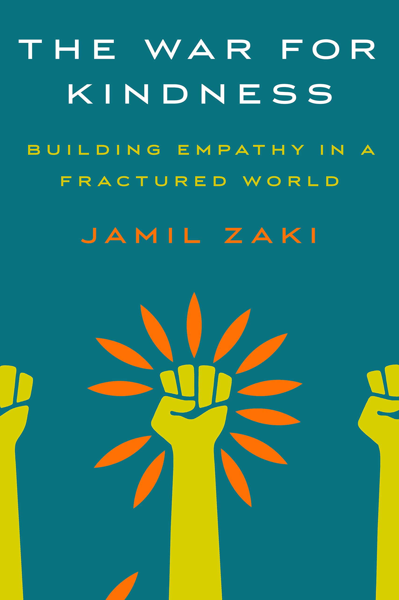

## BLOG
As I read books and news through 2019, I will review outstanding stories critically to share light on them and the authors. Also this year and next year, I hope to look at patterns in the news, develop an artistic expression of a framework around news events, and apply an understanding of technology and photography.

 

## 2019 BOOK REVIEWS
### Reviews Up Next - [The War for Kindness - Building Empathy in a Fractured World](https://www.amazon.com/War-Kindness-Building-Empathy-Fractured/dp/0451499247) by Jamil Zaki

 

 

## 2019 NEWS REVIEWS
### Reviews Up Next - Politics and Government
* [Democracies Try to Boost Public Service](https://www.csmonitor.com/Commentary/the-monitors-view/2019/0701/Democracies-try-to-boost-public-service?cmpid=TW&utm_medium=Social&utm_source=Twitter#Echobox=1562012124)
* [After Most Shootings, Congress Does Nothing. This Time May Be Different](https://www.csmonitor.com/Daily/2019/20190808?cmpid=ema:bundle:20190808&id=1093860)
* [Busing in America: Race Relations, Revisited](https://www.csmonitor.com/Daily/2019/20190808?cmpid=ema:bundle:20190808&id=1093860)
* [Here’s What Foreign Interference Will Look Like in 2020](https://www.theatlantic.com/politics/archive/2019/08/foreign-election-interference-united-states/595741/)
* [A Trade War Over History? Sort Of. Why Japan and South Korea are Feuding.](https://www.csmonitor.com/Daily/2019/20190809?cmpid=ema:bundle:20190809&id=1093889)
* [Tensions Continue High Over Kashmir, With 500 Arrests And A Communications Blackout](https://www.npr.org/2019/08/08/749349432/tensions-continue-high-over-kashmir-with-500-arrests-and-a-communications-blacko)
* [Treasury Declares China A 'Currency Manipulator,' Escalating Trade War](https://www.npr.org/2019/08/05/748439036/treasury-declares-china-a-currency-manipulator-escalating-trade-war)
* [Mississippi Immigration Raids Lead To Arrests Of Hundreds Of Workers](https://www.npr.org/2019/08/07/749243985/mississippi-immigration-raids-net-hundreds-of-workers)
* [To Fight Trump, Take to the Streets!](https://www.thenation.com/article/trump-protest-march-revolution/)
* [The Millennial Left Is Tired of Waiting](https://www.theatlantic.com/ideas/archive/2019/07/democrats-are-experiencing-clash-generations/594808/)

### Reviews Up Next - Capitalism and Innovation
* [A Roadmap for Reshaping Capitalism](https://www.forbes.com/sites/stevedenning/2019/07/07/a-roadmap-for-reshaping-capitalism/#2ea912b6716f)
* [What Innovation Really Means](https://www.aspeninstitute.org/blog-posts/what-innovation-really-means/)
* [Match Group’s CEO on Innovating in a Fast-Changing Industry](https://hbr.org/2019/07/match-groups-ceo-on-innovating-in-a-fast-changing-industry?utm_medium=social&utm_source=twitter&utm_campaign=hbr)
* [Art Is At The Core Of Entrepreneurship, Ignore It At Your Peril](https://www.forbes.com/sites/sophiamatveeva/2019/07/25/art-is-at-the-core-of-entrepreneurship-ignore-it-at-your-peril/#2abe67c965fa)
* [Startups Are Abandoning Suburbs for Cities With Good Transit](https://www.citylab.com/transportation/2019/07/startup-cities-public-transportation-new-business-development/594286/?utm_term=2019-07-25T16%3A27%3A49&utm_medium=social&utm_campaign=citylab&utm_source=twitter&utm_content=edit-promo)
* [Why Some ESG-Friendly Financial Advisers are Careful about Mixing Politics and Portfolios](https://www.marketwatch.com/story/why-some-esg-friendly-financial-advisers-are-careful-about-mixing-politics-and-portfolios-2019-07-02) by Morey Stettner and [Impact Investing, Just A Trend Or The Best Strategy To Help Save Our World?](https://www.forbes.com/sites/jpdallmann/2018/12/31/impact-investing-just-a-trend-or-the-best-strategy-to-help-save-our-world/#3344da9375d1)
* [Instagram is Helping Save the Indie Bookstore](https://www.vox.com/the-goods/2018/12/19/18146500/independent-bookstores-instagram-social-media-growth)

### Reviews Up Next - Technology 
* [This Is What Algorithms See When They Spy on You in Public](https://www.fastcompany.com/90381079/this-is-what-algorithms-see-when-they-spy-on-you-in-public)
* [Natural Intelligence](https://naturalintelligence.com/aron-cramer/)
* [The Amazon Publishing Juggernaut](https://www.theatlantic.com/technology/archive/2019/08/amazons-plan-take-over-world-publishing/595630/)

### Reviews Up Next - Human History, Social Science, Culture, and Environment
* [What Internet Memes Get Wrong About Breezewood, Pennsylvania](https://www.citylab.com/design/2019/07/breezewood-meme-pennsylvania-turnpike-i-70-rest-stop-photos/594559/?utm_campaign=citylab-daily-newsletter&utm_medium=email&silverid=%25%25RECIPIENT_ID%25%25&utm_source=newsletter)
* [Small Towns Fear They Are Unprepared For Future Climate-Driven Flooding](https://www.npr.org/2019/07/25/744203716/small-towns-fear-they-are-unprepared-for-future-climate-driven-flooding?utm_source=newsletter&utm_medium=email&utm_campaign=citylab-daily-newsletter&silverid=%25%25RECIPIENT_ID%25%25)
* [American Culture Wars](https://www.theatlantic.com/politics/archive/2015/07/what-every-american-should-know/397334/)

### Reviews Up Next - The Choices of Facing Community Colleges
* [The Choices Facing Community Colleges](https://www.theatlantic.com/notes/2019/08/choices-community-colleges/595696/)

 

 

### [The Mueller Report: An Educational Tool for Teachers — and A Surprising Hit with Book Clubs](https://www.washingtonpost.com/education/2019/07/24/mueller-report-an-educational-tool-teachers-surprising-hit-with-book-clubs/)
Valerie Strauss, a journalist for The Washington Post, covers The Mueller Report - the report on the investigation into Russian interference, in the 2016 presidential election - a report that has developed into a book that Amazon and local book shops alike put on the shelf for customers to buy. She highlights this phenomenon of The Mueller Report growing into a "surprising hit" not only in bookstores but also in classrooms and book clubs in her news story. She opens the article reporting that Walter Isaacson, a renowned professor at Tulane University, teaches the history of the digital revolution and began to use Mueller's report last year as a tool for students to understand the impact Facebook and Twitter have on politics; other high school teachers and college and law school professors have begun to use the report also in social science and law classes, and Strauss reports that book clubs, like the online Muellerbookclub.com have formed to read and discuss the bestsller.

In sharing this trend in how citizens have been reading about and discussing Mueller's report in bookshops, classrooms, and book clubs, the article's author puts in context Mueller's appearance to testify before two House committees. As political affairs continue, the public should stay informed and understand current events. Strauss further reports on how educators, who want to use the report but don't feel literate enough, can find resources that the News Literacy Project provides to help students learn to distinguish truth from fiction in the digital age; and university professors have worked to make the report more accessible to citizens. The digital, data-driven technologies, which people use to share news and engage in other activities, present a new set of challenges to the government leaders and to citizens. Strauss's article shows how multiple types of organizations have worked swiftly to help the public grow more politically and digitally literate, with people discussing impeachment, historic impeachment controversies, Truth vs. fiction shared through digital technologies, and data security issues, so that people can stay informed and contribute to a healthy society.

Strauss concludes the article with a summary of The Mueller Report. The lessons from the report seem complex, controversial, and daunting to discuss. The report, however, provides an opportunity to address issues like the following:
* Straight news reporting vs. opinion writing/commentary
* Misinformation spread through technology platforms 
* The falsity of a conspiracy theory
* Details of Russia's use of social media platforms
* How the White House misled or lied to the press

After listing and explaining the issues, Strauss covers ideas that people can think about and questions for people to ask when they engage in the classroom or in book groups.

The author, an educator writer, ties together a controversial government issue with a news report on trends in classrooms, bookclubs, and bookstores in her article; and in writing this, she helps readers to grow more informed in the public discourse and supports a country of citizens who desire to understand current events.

 

 

### [Who Maps the World?](https://www.citylab.com/equity/2018/03/who-maps-the-world/555272/?utm_medium=social&utm_source=twitter&utm_content=edit-promo&utm_term=2019-07-25T15%3A49%3A35&utm_campaign=citylab)
Sarah Holder, a writer for City Labs, answers the question, "Who Maps the Word?" in her report. Who has mapped the world across time? "Too often, men" have mapped the world, according to people like "Marie Price, the first woman president of the American Geographic Society, appointed 165 years into its 167-year history", who Holder interviewed. Even though people aim to 
draw in a more diverse group of cartographers into the 21st century process of mapping through democratized projects like OpenStreetMap (OSM). The women who enjoy mapping contribute mostly to humanitarian projects and add value to the field in new service-oriented ways.

Holder shares details about the tool that Price mentioned in the interview. "OSM is the self-proclaimed Wikipedia of maps: It's a free and open-source sketch of the globe, created by a volunteer pool that essentially crowd-sources the map, tracing parts of the world that haven't yet been logged." This new method of creating maps more easily opens up the door to anyone less experienced with mapping. Anyone can volunteer to identify an element not on the map and add it, and experienced editors will review and verify the additions. Many of the applications people use, including Foursquare, Craigslist, Pinterest, Etsy, and Uber, rely on this democratized way of creating maps in their direction services. 

While people like Price hope that OSM's democratic aims support more women cartographers or mappers of color and LGBTQ, Holder reports that men represent the majority of the volunteer community. While a "statistical breakdown of gender equity in the OSM space has not yet been conducted", Holder shares an insight from Rachel Levine, a GIS operations and training coordinator with the American Red Cross, that according to experts, women represent only 2 to 5 percent of OSMers.

Where are the women who engage in mapping? According to Holder's research, women who love mapping contribute to mission-driven organizations like Humanitarian OpenStreetMap Team (HOT) and Missing Maps. To support the humanitarian projects, the organizations have increased the number of volunteers contributing to the work by educating new mappers and organizing map-a-thons with people from everywhere in the world. Organizations have reframed catography projects as service-oriented ones rather than tech-y ones, making the mapping experiences more comfortable for people who are not men; and as a result of the effort, a recent study shows that 28 percent of remote mappers were women, and in projects when organizations worked directly with community members, 48 percent of participants were women. As a result of women-led initiatives, people from places not traditionally involved in cartography have contributed their on-the-ground perspectives to the maps. Being proactive about including more women and girls from all over the world helps to "increase access to health services, safety, and education in developing countries" and put "childcare centers, health clinics, abortion clinics, and specialty clinics that deal with women's health" on the maps; without these women, the OSM community would continue to reject the addition of a "childcare" tag.

Mapping helps people to navigate the world safely. Holder reports that without womens' perspectives, the safety of women in less developed countries would be harder to secure. Maps consist not just of bridges and tunnels like those that men traditionally have created, but they also help to locate safe places, reveal the least dangerous path from point A to point B, and highlight other intangibles. Including women, people of diverse races, and people from the LGBTQ community in the 21st century mapmaking process helps the world "know, classify, and value" space differently. Holder covers ways that people of other races and people from the LGBTQ have been involved in creating maps less because they have not been involved as much; but the author highlights why including more diverse people in projects adds value. Traditionally mapping has been a technical process, not a community-based process, but by proactively including more diverse people, educating people differently, and communicating about cartography in new ways, the final products better serve communities.

 

 

### [Judges Can’t Decide Whether Freedom Extends to Your Car](https://www.citylab.com/equity/2019/07/road-police-power-has-few-limits/593989/?utm_term=2019-07-19T20%3A08%3A56&utm_campaign=citylab&utm_medium=social&utm_source=twitter&utm_content=edit-promo)
Sarah A. Seo in July 2019 reports on the wide descretion that officers have when pulling over motorists with City Lab. Sparking attention to the trend, a week before Seo wrote the article, police arrested and charged a former sheriff's deputy in Florida, Zachary Wester, for professional misconduct when stopping motorists on the rode; because of the wide discretion he had when pulling over motorists for traffic offences, he stopped innocent people planted drugs while searching their cars, and led motorists to prison. This crime that Seo introduces the article with reveals a symptom of a larger issue: poor rules on the road. How much power do police offers have on the road, and how much of it do they abuse rather than use with good conduct? How much freedom do drivers have?

To open draw readers into the search for answers to these questions, Seo, summarizes common road knowledge when writing that "in American culture, driving is an expression of personal liberty", "but under the law, driving is a privilege, not a right, and drivers are subject to extensive police surveillance." With little cited research or quotations backing her up, the author reports that for years, lawyers have questioned how to regulate road safety. Should police officers search the entire car of a suspect pulled over for a traffic violation and impose on motorists' freedom? Or do limits exists before police enforce laws on the operation of motor vehicles? What type of evidence of a suspicious crime do police need before conducting a search? Seo reports that courts struggle to answer these questions, and "jurists have usually punted on them", leaving serious "consequences for our civil liberties."

Cars symbolize liberty culturally, and Americas see their cars as "private spaces." To highlight evidence for this fact, Seo cites a 1924 Ford advertisement: "To own a Ford car is to be free to venture into new and untried places". A century later, the car symbolizes the same concept in a Dodge tagline: "Here's a couple things America got right: cars and freedom." Ideally, according to culture, drivers can experience freedom on the road, but because of regulation on the road, drivers often experience threats to liberty; drivers' safety rules over drivers freedom, and rules help to ensure safety.

Regulation helps to ensure safety, and ideally the laws protect drivers from traffic violations and prevent police offers from having too much liberty. Seo presents the Mitchell vs. Wisconsin case in which police ordered a blood test on a drunk driver without first obtaining a warrant; Wisconsin "authorizes warrantless action if a motorist is unconscious." Seo reports on states' laws in more detail and explains issues around implied-consent. The ultimate question is "what are the limits on the state when dealing with serious problems like reckless driving?", and the Supreme Court defers answering these questions to the judgment of the police, giving them freedom to use their own discretion; thereby, police have leeway in emergency situations without judicial oversight. The Wester case that Seo reports on at the beginning of the article represents the negative symptoms of low judicial oversight; police with leeway may abuse their position of authority. While reasoning exists behind the current legal structure, Seo draws readers' attention to why the failure of the course in "plac[ing] stricter limits on what the police can do while enforcing the rules of the road" poses troubling problems that need monitoring like the oversight that Wester needed.

 

 

### [Art Is At The Core Of Entrepreneurship, Ignore It At Your Peril](https://www.forbes.com/sites/sophiamatveeva/2019/07/25/art-is-at-the-core-of-entrepreneurship-ignore-it-at-your-peril/#55c1b9e65fa9)
Sophia Matveeva, contributor at Forbes Media, covers the relationship between art and entrepreneurship. The author highlights two creators, Noble.AI's CEO and Marianne Moore, who to report how art and lateral thinking positively impact the business world.

To open the article, the author reports on how people currently tend to revere STEM, with technology speedily moving the world, and neglect art and humanity; employers tend to hire students with degrees in STEM more than they employ ones with experience in the arts or humanities. Countering the trend, Matveeva shares that the most interesting people she personally knows have diverse interests, understand both the arts and the science, and live like Renaissance men and women; and she explains the fact that art, of any form, expresses universal and eternal truths about the human condition. Because humans use the majority of products - software, dresses, watches, or a book - a narrow focus on technology or financial metrics dismisses what users need, how people will use the product, or how a product differs from others. Two people working in the business world share why this is true for them.

Noble.AI, a California-based company, makes Articial Intelligence, and the CEO has placed an emphasis on aesthetics in addition to the technology. People must experience ease when using the technology, and the product must please users. The startup recognizes the importance of humans, who have a wide range of interests, because they use the products at the end of the day. 

Matveeva covers the startup to show how art contributes to the technology-driven world and makes it more advanced. People tend to avoid taking the risk of sitting with people different from them because of fear; but when hearing only the beliefs and thoughts of colleagues that reinforce one's own perspectives, people do not hear new, unconventional ideas that contribute to a better product experience. Thus the founder of Noble.AI promotes diversity and encourages people to develop wider interests so that they produce more original work, draw connections they would never anticipate making, and see the needs of the customers. Without artistic, creative thinking, entrepreneurs would not succeed in growing a successful business; and without the freedom to think laterally, entrepreneurs would not have as much fun in the process of building a business.

The author shares the thoughts of an innovator, Marianne Moore, who created her own consultancy, Justice Studio, and paints on the side. Matveeva reports that Moore sees "creating art and creating a company" as "extensions of the same trait: seeing an idea in your head and then making it come to life." A STEM-driven world does not like people who break out of the box and do things differently, and society often tells people to just be one thing, though; if Moore had listened to the world, she would not be so successful as a "creatrix of art and companies."

Through the author's reports of successful business leaders, she shares how creativity drives successful entrepreneurship. While the world has worshipped STEM, art and humanity provide sustaining value to the STEM-driven society and change things up.

This article covers an interesting trend and captures an aspect of the business world that some overlook. Books and articles exist on this topic, and the author does not cover everyone in the domain of entrepreneurship who has discovered the importance of being creative and understanding the human condition. She also does not write about the trend in the form of a deep news story. Regardless, she reports good innovative activity in a business journal.

 

 

### [How to Save Politically ‘Mixed Marriages’ in Trump Era](https://www.csmonitor.com/Daily/2019/20190708#1091867)
Politics often starts in family members' backyards, where spouses, siblings, or uncles hold radically competing political views. How do family members make peace and not war in their own homes and neighborhoods? How do I choose whether to respond with love, understanding, or rage towards my family member? Stephen Humphries responds to this issue through an article covering Jeanne Safer, a psychotherapist, who for years "has received letters from people whose personal relationships have been upended by political differences", and her book. The article's author shares how since Safer, as a liberal New Yorker, has been in a politically mixed marriage with a senior editor at the National Review, she has been able to write about her experiences in ["I Love You, But I hate Your Politics: How to Protect Your Intimate Relationships in a Poisonous Partisan World"](https://www.amazon.com/Love-Hate-Your-Politics-Relationships/dp/1250200393). Stephen Humphries lists the questions the book answers and summarizes the responses to each issue.

* Why do people take politics so personally? 
Politics involves people making arguments, and people tend to feel compelled to change people's minds because otherwise they don't have emotional effect on people and feel like others have power over them. People will never persuade someone who has a different view of the world, and once people realize this they will more freely begin in actual discourse because they start from a place where they can radically respect the other person's selfhood and right to hold an independent view.

* With you and Richard, what is the difference of values between you? 
Values drive politics and world views; but values differ from political philosophies. For this reason, Safer covers values in the chapter called "What is a core value?". She explains through a story how people, who may fight with each other and hold different world views, may discover that they share core, fundamental human values in common.

* So, to understand where people are coming from, you have to have mutual respect?
To understand others, people have to understand themselves and their prejudices, resistance, and motives. Sharing articles capturing one's own point of view will not ever help to bring light to a situation with someone else from another perspective.

* Has social media made it more difficult to have real dialogue?
Social media does not support dialogue, and this is why the Safer commands to avoid social media. Social media presents someone's diary, and people feel more tempted to react destructively on social media when they see personal information. If someone has something to say to someone more seriously, write a letter, call, or go see them, and taking these things will save relationships.

* So it is possible to preserve relationships in this fraught era?
Think about the good qualities of people who hold different views, and think of people as friends as children. Thinking these things can help shine the light on what is right with people and in relationships rather than what is wrong; thinking these things helps people avoid politics.

 

 

### [What Americans Do Now Will Define Us Forever](https://www.theatlantic.com/ideas/archive/2019/07/send-her-back-battle-will-define-us-forever/594307/)
Responding to white nationalism, Adam Serwer informs readers that the United States of America stands at a pivotal point. Serwer opens the article by recounting the National Conservatism Conference at the Ritz-Carlton in Washington, D.C., where the conference organizer, Yoram Hazony, explicitly rejected white nationalism. Despite Hazony's efforts to denounce everything that "'nationalism' is, at its core", including "defending borders, eschewing military interventions, and prompting a shared American identity did not prevent attendees", conservative attendees "explicity declar[ed] that American laws should favor white immigrants." Covering the other perspective, Serwer shares that other attendees "took pains to distance themselves from the president's brand of nationalism."

With people voicing different perspectives on white nationalism, what was the purpose of the conference? Serwer explains the mission of the conference: "the conference stood solidly within the conservative intellectual tradition, as a retroactive attempt by the right-wing intelligentsia to provide cover for what the great mass of Republican voters actually want." The consensus regarding nationalism is that it already existed before the election of Donald Trump, and Trump renews an old ethnic-chauvinist tradition after years of [civic nationalism](https://www.debatepolitics.com/general-political-discussion/140310-difference-between-nationalism-and-ethnic-nationalism.html), or fragile recognition of all citizens regardless of race, creed, color, or religion as equal. Serwer comments that "conservative intellectuals cannot rescue nationalism from Trump" because he "appeals to racial and religious traditionalism" that has already existed and that has bounded conservative voters to the Republican party; conservative intellectuals had not paid attention, and they were thus caught off-guard by Trump; but now at the conference, they come together with traditional nationalists to engage in discussion.

Serwer captures well the full spectrum of political arguments through  highlighting Trump's comments at the rally in North Carolina, the most recent example of Trump's engagement in intolerance towards people of other races, and the arguments against and in support of his words. Many liberals accuse Trump of racism; the Equal Employment Opportunity Commission categorizes telling American citizens of another race, as Trump did to four congresswoman, as "textbook racism." Republicans in support of him, but against racism, comment how "the president was criticizing their left-wing views and 'hatred for America'" to back up the Republican's intellectual beliefs rather than nationalistic beliefs, in the face of American citizens' remarks on Israel and criticism of the US. Summarizing Trump's false accusations and potentially valid concerns, Serwer writes: "Trump has falsely accused Omar of supporting al-Qaeda, of betraying her country. But when a foreign power attacked American elections, it was the president who first sought to profit from that attack, and then to obstruct the investigation into it, and finally to offer a vocal defense of the perpetrators." If American citizens of other ethnicities back up other countries representing their racial origin over the United States of America then they should return to their "home" countries. Encapsulating the politics, Serwer expresses: "That Trump’s supporters believe Omar’s sins justify her banishment, and Trump’s similar transgressions justify his presence in the White House, helps illustrate exactly what is going on here. Under Trumpism, no defense of the volk is a betrayal, even if it undermines the republic, and no attack on the volk’s hegemony can be legitimate, even if it is a defense of democracy."

Whether Republicans agree with the statement or not, "Racism is at the core of Trumpism. The movement cannot be rescued from its bigotry, and those at the National Conservatism Conference who believe it are in denial." Conservatives can express their thoughts on the intellectual ideals underlying their political party, but as long as the ideals tie to Trump or Trumpism the party remains tied to white nationalism, not civic nationalism. Does the country want white chauvinists to govern? Does the country want to appeal to bigoted behavior? Or does the country want to be multiracial? Over the past years, Serwer opens his articles with explorations of American history to analyze current events; and he argues that America has never before reached this pivotal point in the unfoldment of the idea of country.

Covering history, Sewer explains how white nationalism was part of the doctrine governing the country in 1965. Other presidents have exploited racial division for political reasons. But, after doing thorough historical analysis, Sewer argues that "we have never seen an American president make a U.S. representative, a refugee, an American citizen, a woman of color, and a religious minority an object of hate for the political masses, in a deliberate attempt to turn the country against his fellow Americans who share any of those traits. Trump is assailing the moral foundations of the multiracial democracy Americans have struggled to bring into existence since 1965, and unless Trumpism is defeated, that fragile project will fail." This is a unique point in time in which people are making decisions that define the country on racial terms; will decisions be destructive or constructive?

Making a case of multiracial America, Sewer writes, "Still, a plurality of Americans in 2016 and 2018 voted against defining American citizenship in racial terms, something that has perhaps never happened before in the history of the United States. There was no anti-racist majority at the dawn of Reconstruction, during the heyday of immigration restriction, or in the twilight of the civil-rights movement. The voters of this coalition may yet defeat Trumpism, if they can find leaders who are willing and able to confront it." People can make decisions that lead to the dream of civic nationalism; but no guarantee of people making these decisions exists in an environment, where an authoritarian president leads, and where both of the two political parties struggle to fulfill their constitutional responsibilities for different reasons.

In response to the president's "declarations of immunity from oversight", the Democrats have been shy as they have "slow-walked investigations, retreated from court battles, and unilaterally surrendered the sword of impeachment." The Democratic party struggles to lift its feet, and the party will have little resources to understand the presidential abuses thoroughly before the campaign season begins. For this reason, the country faces challenges that it has never before seen. As the Democratic party remains timid, Trump has worked to "abet a foreign attack on American democracy", "obstruct justice", and "vow to turn federal law enforcement on his political enemies"; "there are squalid camps at the border where families are being separated, and children are being sexually assaulted." Why have Trump's tactics to "rig American democracy in favor of white voters", "refuse to recognize the oversight of authority of Congress", and "assail the cornerstone principle of multiracial democracy" not called the Democrats to more active ways of responding? Sewer asks a rhetorical question, and he concludes that the Democratic party's weakness in "defend[ing] the principle that America belongs to all of its citizens, regardless of race, creed, color, or religion" contributes to the "bolder challenges to democracy and the rule of law". According to Sewer, while people do not need to agree with the attacked politician's political opinions, not defending the African-American politicians, in the face of the threats on their citizenships and racial identities, poses a threat to the American idea of a multiracial democracy that will not be defended elsewhere if not defended in this nation; Sewer ends the article reminding Americans that "What [they] do now, in the face of this, will define [them] forever."

As Sewer intertwines insights from both a historical analysis and the analysis of current events in his story, he covers multiple perspectives, defends a multiracial country, and calls people to action by saying that the time is now. While he successfully does this, he fails to cover thoughts on what will happen after politicians and citizens making defining decisions. His article well informs readers of events happening in the United States and guides politicians' and citizens' in making decisions and developing opinions.

 

 

### [Debate Deadline Day: 20 Candidates Set to Crowd the Stage in Detroit](https://www.politico.com/story/2019/07/16/democratic-debate-candidates-deadline-1417060)
To prepare Politico's audience for the second series of debates, Zach Montellaro shares the names of the 20 candidates that have qualified for an opportunity to argue a political viewpoint, in Detroit on July 30-31. For Montana Gov. Steve Bullock, who missed the first debates in June but gained the tiebreaker for the 20th spot, this round will be his first chance to win support in the public polls; many of the candidates will not have another chance to debate after this one.

Listing out the 20 candidates, Montellaro names the politicians: "Michael Bennet, Joe Biden, Cory Booker, Bullock, Pete Buttigieg, Julián Castro, Bill de Blasio, John Delaney, Tulsi Gabbard, Kirsten Gillibrand, Kamala Harris, John Hickenlooper, Jay Inslee, Amy Klobuchar, Beto O’Rourke, Tim Ryan, Bernie Sanders, Elizabeth Warren, Marianne Williamson, and Andrew Yang."

After naming the candidates, Montellaro covers the importance of the debates for fundraising, a challenge that all candidates face; they all share the risk of running out of money, and the debate on CNN provides them with attention so that they can attract interested fundraisers and shift the course of their campaigns. Currently, "candidates need 2 percent in four national polls and 130,000 unique donors", and six Democratic presidential candidates - Biden, Buttigieg, Harris, O'Rourke, Sanders, and Warren - have met both of the increased thresholds. The DNC's polling and fundraising thresholds will rise, so lesser-known candidates will experience pressure, and gaining a national audience with a major media group will not grow easier. 

Unlike journalists in other news outlets, Montellaro writes less about the political issues and the candidates themselves, and he writes more about the reality of the political competition, the fundraising thresholds, and the importance of media coverage. His article helps readers understand the importance of the debate and the CNN coverage for the campaigns, and his article prepares readers to listen closely to the arguments on July 30-31 amdist the pressure on the politicians. Reading other articles covering the candidates' individual backgrounds and the deeper issues will prepare readers further to hear the arguments.

 

 

### [How President Trump Became the GOP’s ‘New Normal’](https://www.csmonitor.com/USA/Politics/2019/0715/How-President-Trump-became-the-GOP-s-new-normal)
Amidst the Democratic party's debates, Republicans consider how President Donald Trump's provocative style changed public discourse as they prepare to make decisions that impact the future. In the middle of July, 15 days after the first series of the Democratic party's clashing of ideas, Linda Feldman highlights how a staunch Republican, Ari Fleischer, who served as President George Bush's press secretary, left the ballot blank because of his dislike of Trump's approach. While three years later, Mr. Fleisher says he would vote for President Trump because of his policies, he claims that "the president rhetorically goes too far", and Republicans need to speak up to prevent his speaking style from becoming normalized.

Everyone paying attention to Twitter from the White House has seen Trump's rhetoric, and it's disgusting. Feldman shares a recent example of his words that go too far in Mr. Fleischer's opinion. 

"The president went on a Twitter tirade against a group of Democratic congresswomen of color – calling on them to 'go back' to their countries of origin, though all but one are American-born. By Monday afternoon, only about a dozen Republicans in Congress had contradicted him.

One of Mr. Trump’s closest allies on Capitol Hill, Republican Sen. Lindsey Graham of South Carolina, doubled down on the president’s point. 

'We all know that AOC and this crowd are a bunch of communists. ... They’re anti-Semitic. They’re anti-America,' Senator Graham said on Fox News, referring to Rep. Alexandria Ocasio-Cortez, D-N.Y., who was born in New York.  

Mr. Trump then reinforced Mr. Graham’s commentary by tweeting it out. 

For his part, Mr. Fleischer tweeted Monday that Mr. Trump’s statement was 'completely inappropriate.' But he says the incident doesn’t change his support for the president."

While Mr. Fleischer applauds Trump's stance on policy, he does not support his inappropriate communication style. But with limited pushback on Trump's manners from other Republicans, is the party submitting to a "new normal"? Party leaders like Mr. Fleischer hope to reconsider whether they submit fully to this and think carefully while heading into the future. Other Republican leaders have begun to speak up also. Feldman explains, "on Capitol Hill, negative Republican reactions began trickling in Monday afternoon. The two African American GOP members – Rep. Will Hurd of Texas and Sen. Tim Scott of South Carolina – registered their objections. Most of the other Republicans who pushed back on Mr. Trump have been known to criticize him before, including Sen. Susan Collins of Maine. She said she disagrees 'strongly' with House progressives on policy but called Mr. Trump’s tweet 'way over the line.'" But dominant Republicans still stand behind Trump in leading with aggressive tactics, opening the way for American citizens to ask "what is normal?"

Feldman supports citizen readers in answering this question by defining normal. She writes, "The word 'normal' is deceptively simple. It can refer to a statistical norm in scientifically measurable phenomena, such as weather, and it can also be deployed in the highly subjective world of politics. The philosopher Ian Hacking once called the use of the word 'one of the most powerful ideological tools of the 20th century.'" Trump's way of making false statements through "misspeaking, dissembling, exaggerating in a way typical for politicians and salesmen, or lying outright" is nothing like what the American people have seen before in an era where Twitter, Youtube videos, and Facebook lie in our hands; and his "outisize[d] presidential personalit[y]" compares to historic ones, including Andrew Jackson's and Teddy Roosevelt's. Historically, more conventional figures - Martin Van Buren and William Howard Taft - have succeeded these types of presidents and shifted the country back to "normal", or moderacy. "'The political system is making choices every day about how much of this we accept,'" however, as Ms. Greenberg says, and people on both sides of the aisle, within a country of free men and women, can speak up to decide what becomes normalized within the country.

 

 

### [Onstage, Democrats Clash on Ideas. Offstage, Is There More Common Ground?](https://www.csmonitor.com/USA/Politics/2019/0628/Onstage-Democrats-clash-on-ideas.-Offstage-is-there-more-common-ground)
During the second night of the Democratic presidential candidates debate in Miami, FL, Jessica Mendoza wrote on how onstage, the audience saw the chaotic, clashing of ideas, but offstage, citizens asked the question, "can everyone stand on more common ground and against the threat that President Donald Trump poses?". After painting the picture of the first night of debates well with a vibrant vocabulary, the political chaos came to greater life after the second night with 20 candidates in the Democratic party disagreeing over how to unify the party and the nation.

As the party and the nation search for a "unifying figure", candidates debated to answer the main question:  "how far left does the Democratic party go in governing?" On one side of the debate, pragmatists argued, and Vice President Joe Biden embodied this subparty. On the other side of the debates, idealists argued, and Senator Warren and Senator Bernie Sanders competed in "argu[ing] that America’s problems are far bigger than the man in the White House and will require radical, systemic overhauls of government and the economy." Creating more dissonance on stage rather than resonance, candidates answered the question of how they represent the demographics and experiences of the younger generation, and argued that older candidates should "pass the torch." Mendoza highlighted Sen. Kamala Harris, who represents African-Americans, and Mayor Pete Buttigieg, who represents the gay community, to portray how newer candidates better represent younger Americans. Mendoza ignored newer, entrepreneurial candidates like Andrew Yang, who has a background in working with young post-college students in startups and supporting human-centered capitalism, until later in the story.

Onstage during the debate, the American people saw disagreement, but offstage, Mendoza shared how debate attendees observed "a kind of camaraderie emerg[ing]...as candidates and their staff were forced to interact and at times even work together." Offstage, all candidates agreed on seeing President Donald Trump as a threat to the nation's health, particularly due to the destructive immigration policy; and citizens at the debate outside witnessed candidates mutually denouncing the Trump administration's immigration policy outside of the Homestead Temporary Shelter for Unaccompanied Children, a migrant children's detention center. As debate attendees saw candidates yelling "We love you!" in Spanish to the locked-in children with heart-shaped signs. Leaving idealist readers with hope, Mendoza summarizes, "It was somewhat remarkable to see a group of candidates who, less than 10 hours earlier, had been battling it out onstage now sharing a microphone and nodding together as each spoke in turn. It was a reminder that, for all their differences, the Democrats still have more that unifies them than divides them."

Ending the story, Mendoza writes that "Game 1" sends the overall vibe of the event preceding a series of debates leading into 2020, with [the second round occurring in Detroit on July 30 and 31](https://www.politico.com/story/2019/07/16/democratic-debate-candidates-deadline-1417060). Many standing with politicians, like political observers, Democratic voters, and campaign managers, at the end of the day, have their eyes and ears open simply for a "candidate who speaks to them - someone who has conviction, who conveys compassion and authority"; Mendoza provides comments from people on how the party can't be subdivided as much as they appear to be in the media when everyone grows united around the shared values that underly agendas. I think these statements ignore the nuances of the different, competing means to achieve certain ends; but Mendoza captures multiple sides of the story in this article, including pro-Trump protesters at the event.

 

 

### [How to Talk to Small Kids about Big Issues Like Border Walls](https://qz.com/1659920/how-to-talk-to-kids-about-immigration-and-trumps-border-wall/?utm_source=Twitter&utm_medium=qz-organic&utm_campaign=hootsuite)
Normally, adults prefer to preserve the innocence of their little ones' and not talk to them about the harsh realities of the world. Ephrat Livni, a writer for Quartz, wrote in July 2019, on how to talk to kids about big news and issues because he claims that "kids hear things" anyways, through fragments of conversations. If kids already overhear fragments of the issues, why do adults not discuss the full picture with little children more thoughtfully? Livni shares information on a book to convey how possible ways for adults to talk realistically about issues with their children exist; adults do not have to over-shelter their children.

On July 9 in the US, Happy Fox Books released [The Wall: A Timeless Tale](https://www.goodreads.com/book/show/43973339-the-wall), by Giancarlo Macri and Carolina Zotti, with illustrations by Mauro Sacco and Elisa Vallarino. The book, "a bright, humorous, and lively" one, "with a sweet and very simple style designed to facilitate conversation about complex issues, educate, and entertain", can help address the problems, Livni writes. Children's experiences confirm that the life lessons that books teach can help children make decisions in the real world. That's why it's magical that Livni summarizes the book's story through the following paragraphs:

"[The Wall: A Timeless Tale](https://www.goodreads.com/book/show/43973339-the-wall) tells the story of a king who has not left his castle for a long time. When he finally emerges and surveys his land, he finds it’s full of all different kinds of people, and he urges an aid to build a wall to keep out anyone who looks unlike him (he is blue and others are a slew of different colors). The aid (who is also blue), is skeptical of this plan, and asks, 'Sir, are you sure?'

But the monarch says he is, so his assistant follows instructions, driving out everyone who doesn’t look like them and constructing a barrier. The king’s wall manifests in the book as a thick cardboard pop-up barrier emerging from the text’s spine. It’s tactile, tough, and can withstand the grabby hands of even the most engaged child readers while clearly demonstrating the effects of separation. Page by page, the kingdom grows less colorful and rich, the space on the pages surrounding the king more blank...

...When all the king’s wishes have been fulfilled, he is still unsatisfied. The kingdom is crowded and colorful again and the book’s pages are filled with different faces, but the wall now appears to the leader an unnecessary barrier because all the people inside and outside seem so talented and attractive. So he calls for its destruction, blaming his assistant for ever building it. When the wall is down again, he happily tells his aid, 'This is much better. I’m glad I thought of getting rid of that wall!'"

These paragraphs bring visually the news article's audience into a childlike reading experience, sharing a new way to teach kids about controversial, world affairs. Livni uses few of his own words and ideas, but he shares a new type of story for children that can help students engage with the news. I think that the article would improve with more of Livni's own interpretation and commentation; I think he needs to express a larger overarching argument that uses sources other than just [The Wall]((https://www.goodreads.com/book/show/43973339-the-wall)) as supporting evidence for how and why adults can educate their kids about social issues in the media. Despite the weakness of the article, I love the topic and hope to read the book! And I hope to see more like this book also!

 

 

### [Independence Day in a Divided America](https://www.theatlantic.com/ideas/archive/2019/07/unity-fourth-of-july/593206/?utm_term=2019-07-04T20%3A08%3A53&utm_campaign=the-atlantic&utm_medium=social&utm_content=edit-promo&utm_source=twitter)
Conor Friedersdorf, a staff writer with The Atlantic, wrote on Independence Day, during this time of 21st century political fragmentation. Directing words to US citizens on the 4th of July, he captures the ability of the US people to find common ground amidst polarizing viewpoints through Abraham Lincoln's words: “A husband and wife may be divorced and go out of the presence and beyond the reach of each other,” Abraham Lincoln observed, “but the different parts of our country can not do this. They cannot but remain face to face, and intercourse, either amicable or hostile, must continue." Through this statement, Friedersdorf expresses confidence in the solidity of the United States of America and in the American people's ability to stand undivorced; and no better day than the 4th of July exists to remind us of our united, unseparated states.

Writing on the history of the country's celebration of its independence during major periods - the signing of the declaration of independence, the emancipating of slaves, the proclaiming of common ground a decade after the civil war, the fighting for freedom by new immigrants in the early 1900s, and the celebrating of the Bicentennial during post-Cold War period - Friedersdorf highlights moments in which Americans stood united and overcame challenges to reawaken the nation's purpose. 

In the late 1700s, initially, only nine of the original 13 colonies voted for independence; but three days later, three more colonies joined in to vote, leading to solid support behind the new nation. And despite the new nation not living up to its ideals at first, Frederick Douglass praised the Founders' best qualities in his oration during the civil war period, expressing confidence in the country's ability to overcome racial divides. Although at the end of the civil war period, the "new black 'freedmen'" felt more free to celebrate the country's national holiday than did the Caucasian Americans, with the emancipation of slaves "complet[ing] the American Revolution", Americans together declared, a decade later, the Fourth of July to be a "common heritage" for both black and white, and northern and southern people. Americans continued to explore how to find this common heritage as a new wave of immigrants entered into the country, seeking freedom, in the 1900s; the immigrants fought for the barriers between newly naturalized citizens and native borns to be swept aside. And after the tumult of the Cold War years, Americans found healing through the celebration of the Bicentennial and felt free to unite around the spirit, with someone writing, "This has rejuvenated my faith in America".

As demonstrated through each of these major periods, America finds ways to evolve from a nation faced with trials into an even stronger country with belief in the words, "all humans are created equal and 'endowed by their Creator with certain unalienable Rights, that among these are Life, Liberty and the pursuit of Happiness'", at the end of the day. Though sometimes these words may seem like ["luminous rhetoric"](https://www.amazon.com/Where-Do-We-Here-Community/dp/0807000671) only, Friedersdorf purposefully presents how "the principles of the declaration are still there to unite us, even amid the persistent divisions that define this moment".

While Friedersdorf applies an understanding of history to make a statement and to capture the heart of the common citizen on a national holiday, I do not think he expresses the theme overarching the article strongly enough, and I do not think he weaves the theme throughout the article from period to period well enough. I do not think he successfully conveys the main point because he leaves out the many details that press on the minds of both citizens and politicians in the debates, lead to collective psychosis, and create a sense that the statement, "all humans are created equal", is filled only with ["luminous rhetoric"](https://www.amazon.com/Where-Do-We-Here-Community/dp/0807000671); and I think he loosely ties together the historic periods he highlights with an interconnecting argument for a binding belief. At the end of the article, however, I do believe that the country can put rhetoric into practice and overcome the current crisis of polarizing viewpoints; but collectively we must move from carrying belief in an idealistic dream to fulfilling the beautiful dream.

 

 

### [How Hinduism Became a Political Weapon in India](https://www.theatlantic.com/international/archive/2019/05/hindu-nationalism-narendra-modi-india-election/590053/)
On May 24, 2019, Jonah Blank wrote an article on how religion drives politics in India. With eloquent language, the author, Blank, depicts the landscape in which Hindu priests read Sanksrit chants and engage in other religious activities. Then, he states "the creed of the governing Bharatiya Janata Party (BJP)" - Hindutva, which differs from the Hinduism religion; and the relationship between faith and politics drives the politics of one of the largest nations on Earth. While the author uses great language and explains the difference between Hindutvi and Hinduism well, Blank fails to depict the conflict between Hindus and Muslims, which makes stronger the point of religion influencing politics.

Moving on to portray the holiest Hindu city, Blank shifts from the main point of the news article to a specific place within the story that provides supporting evidence of the relationship between faith and politics. Describing the politics, he shares how in the city "posters of Prime Minister Narenda Modi are slapped" everywhere with "orange-and-green flags bearing the lotus leaf", and citizens can see few election signs representing competing parties. Describing the relationship between Hinduism and politics, he explains how Modi, who has just won a second five-year term, seeks to reformulate the Hindu religion so that practitioners' grandparents no longer understand their faith; Modi is using religion as a "political weapon", and while Blank still does not mention Muslims, Modi is doing so amidst great warfar between Hindus and Muslims. 

What explains the radical change? Identity explains the change. People in the country, particularly those behind the Hindutva movement, need to reshape the caste system and "decolonize" ([India: how some Hindu nationalists are rewriting caste history in the name of decolonisation](http://theconversation.com/india-how-some-hindu-nationalists-are-rewriting-caste-history-in-the-name-of-decolonisation-114133)).

Blank writes about how across all major religions, "for many today, religion is less a matter of what you believe, or even what you do, than of who you are". Hindutva translates into "Hindu-ness", suggesting an element of identity, and people think of Hinduism as more of an identity than a theology. Until now, people in the Hindu religion would have never expected to agree in how they identify themselves; family, village, or caste have rather been at the root of their identities. The Hindutva movement, which began during the Colonial period, started as a result for a political desire for developing a shared identity to unite everyone in India, while not dictating what people should believe; and few leaders within the movement have been holy leaders. The Hindutva movement supported branding the country, not indoctriating the citizens. While Modi has not always worked on the Hindutva platform, the Prime Minister now uses it as a weapon and praises Gandhi, who reshaped Hinduism significantly more than the Hindutva movement founders did, to embrace nonviolence rather than to brand the country. Modi needs a tool to decolonise the country, and Hindutva serves as that tool.

As Modi amplifies the Hindutva pitch, Hindus war against Muslims and Muslims war against Hindus in the land. Campaigning on the Hindutva platform supports the country's national identity amidst this warfare. Summarizing the identity issue  behind Modi's work, Blank writes the following: "Instead, the issues are those of identity: We’re being outbred by minorities. We’re being laughed at by the world. We’re overrun with immigrants—and you know what kind. We’re second-class citizens in our own nation. Make India Great Again." As people in the US have expressed fear of minorities, and people who are different and not traditionally part of the dominant group, like Muslims, people in India have expressed similar fears. Campaigning on the Hindutva platform helps change India in the way people with concerns need it to change through the political exploitation of religion.

To further provide evidence in support of the article's main point, Blank moves the focus onto Delhi, another city. Hindutva determined the election results in this city; and Hindutva dominated the debates. Hindutva is helping through the heart to change the country and reshape it and the caste system ([India: how some Hindu nationalists are rewriting caste history in the name of decolonisation](http://theconversation.com/india-how-some-hindu-nationalists-are-rewriting-caste-history-in-the-name-of-decolonisation-114133)). The reshaping is not on the basis of religious ideology, however; the reshaping is on the basis of something deeper than the eyes - the heart of identity: "Hindutva is not about what your eyes tell you; it’s about what your heart tells you. It’s not about what you see; it’s about how you see yourself. How you see your identity, your brand, your place in the world. Understand this, and you can better understand the changes under way in India."

 

 

### [Opinion: The People Screaming for Blood Have No Idea How Tech Actually Works](https://www.nytimes.com/2019/06/04/opinion/facebook-google-regulation.html) 
On June 4, 2019, Kara Swisher wrote an opinion article on how regulators have grown more concerned with controlling technology but in haphazard ways. Swisher explains how over the past decade, technological risks have existed, but legislators have not cared what technology companies do with sloppy management of data and infrastructure a few years ago; warning signs of "rampant disinformation, egregious privacy breaches and in-plain-sight addictive elements built right into the medium" existed a decade ago, but regulators have never mitigated problems proactively or taken steps to understand the technology. Now, once problems grow more severe, legislators and policy makers enter the scene with legal pads to address privacy and security issues, but they do so in thoughtless ways that demonstrate poor understanding of the best solutions. Ultimately, Swisher argues that while she agrees that America must regulate technology, self-interest drives the current efforts, making them reactive; and America needs more proactive and collaborative work.

The author's negative sentiment on how the time has passed for regulators to step in and that they have not implemented a forward-thinking approach makes sense; but technology companies expect to build bigger, more expansive tools that may create even more risk  over the next ten years, so it is imperative that regulators do thoughtful work now. Swisher fails to mention the work that groups likes [Aspen Technology Policy Hub](https://www.aspentechpolicyhub.org/#/) and [The Bridge](https://thebridgework.com/) have coordinated to connect policy makers, regulators, and technologists. As demonstrated by the thought from these groups, potential for creative collaboration and positive solutions lies ahead, and their work resonates with the author's concluding opinion:

"Instead of just reacting, we need our government to be creatively proactive. Regulators should be thinking about how to use federal incentives to spur small business creation to bring meaningful jobs and new innovations to this country; how to persuade investors to spread more venture capital beyond the three states (California, Massachusetts and New York) that get most of it; how to push for a more diverse work force and fund ambitious education programs, which other countries do without pause; how to anticipate the human impact of the next group of technologies like artificial intelligence and advanced robotics; how to create the most forward-thinking infrastructure plan to modernize our cities; and how to encourage tech to focus on innovations to combat existential issues like climate change, and food and water shortages."

 

 

### [Opinion: Community ‘Weavers’ Create Stronger Social Fabric](https://www2.ljworld.com/opinion/2019/feb/23/opinion-community-weavers-create-stronger-social-fabric/) and [A Nation of Weavers: The Social Renaissance is Happening from the Ground Up](https://www.nytimes.com/2019/02/18/opinion/culture-compassion.html?action=click&module=RelatedLinks&pgtype=Article)
On February 18, 2019 and February 23, 2019, David Brooks wrote opinion articles [A Nation of Weavers: The Social Renaissance is Happening from the Ground Up](https://www.nytimes.com/2019/02/18/opinion/culture-compassion.html?action=click&module=RelatedLinks&pgtype=Article) and [Opinion: Community ‘Weavers’ Create Stronger Social Fabric](https://www2.ljworld.com/opinion/2019/feb/23/opinion-community-weavers-create-stronger-social-fabric/). In the articles, he covered the work with the Aspen Institute to move beyond hyper-individualism and tribalism in order to repair social relationships through satisfying commitments and service to the common good. 

In a world where there's a rise in social isolation, a decline in commitment to religion, and an increase in partisan politics, people seek middle ground and alternative ways of being human. [Weaving people together](https://www.aspeninstitute.org/programs/weave-the-social-fabric-initiative/), embracing people's deeper selves, and building bridges across divides through dialogue and creative expression helps to begin to meet the needs of those seeking substance and healing. Brooks's opinion resonates with work that people are doing elsewhere with [The Gathering Summit](https://www.gatheringsummit.com/) to gather people together more creatively and artistically in both the secular and religious worlds; and research on [reimagining religion and creative communities](https://crcc.usc.edu/reimagining-religion-the-10-qualities-of-creative-communities/) also ties together with claims that lead to his opinion. To strengthen any news article on weavemaking, capturing the broader views on community development coming from leaders with [The Gathering Summit](https://www.gatheringsummit.com/) would strengthen the story; and in stories covering community, there exists much to unpack given the realities facing politics, religion, the mental health system, and spiritual organizations. 

Brooks acknowledges well that highly political people likely will object to his critiques on the state of society, capitalism, and focus on spiritual well-being. Recognizing sources of pushback, and what the counter arguments are, conveys to the reader that he sees other perspectives. However, Brooks remains firm in his opinion that coming together to seek solutions in unity with one another can help individually and collectively to heal within during a time of political fragmentation. Community is not the only way to support people in a time of great change, mental sickness, and divisiveness, but it is a central part to health, and other solutions, products, or forms of human expression can flow out. Recognizing neighbors as whole and encouraging them to bring their full selves to their day to day work through "radical mutuality" underpins the opinion.

It's meaningful that Brooks refers to thoughts of deep thinkers when he writes, "Relationalism had clear (and acknowledged) debts to the Catholic idea of the common good, to Martin Luther King Jr.’s conception of “the beloved community,” to Alexis de Tocqueville’s celebration of American volunteerism and to Edmund Burke’s preference for the small and natural over the large and ideological" to support his opinion. It will be exciting to learn of how people apply his opinion through action.

 

 

### [Beyond Clichés: Teen Anxiety Prompts Closer Look at Young Lives](https://www.csmonitor.com/The-Culture/2019/0307/Beyond-cliches-Teen-anxiety-prompts-closer-look-at-young-lives)
On March 7, 2019, Chelsea Sheasley wrote an article, [Beyond clichés: Teen Anxiety Prompts Closer Look at Young Lives](https://www.csmonitor.com/The-Culture/2019/0307/Beyond-cliches-Teen-anxiety-prompts-closer-look-at-young-lives), with the Christian Science Monitor. The importance and timeliness of a national health topic makes this article newsworthy. This sits online as one of many reports analyzing the challenge facing teenagers.

Relying on insights from interviews with middle schoolers, and results of surveys conducted by Pew Research Center, the report explains why more teenagers experience anxiety. Sheasley summarizes, "There’s no consensus among researchers about what drives teen anxiety, although common theories include fear of failure, the rise of smartphones and social media, changing parenting styles, and a world that feels unusually chaotic." The report informs readers about trends in teen anxiety in concise way and synthesizes data from a variety of sources; however, the report could improve with deeper statistcal analysis of data on anxiety as evidence.

Moving the report on anxiety from what causes the illness to ways to help teenagers, the words, 'It's ok to be kind to yourself' highlight how education on self-compassion shifts how students can learn to respond to challenges and setbacks. Education as a solution presented in this article resonates with the products EVERFI delivers to schools so that students can learn about [Mental Health](https://everfi.com/offerings/listing/mental-wellness/), and [Compassion](https://thecompassionproject.com/about/), a way to help students calm down and better relate to one another. As Sheasley writes, anxiety does not have to be permanent, but building awareness of challenges facing teens, as well as how best to work with them inside and outside of the classroom, helps people to address the public health issue.

 

