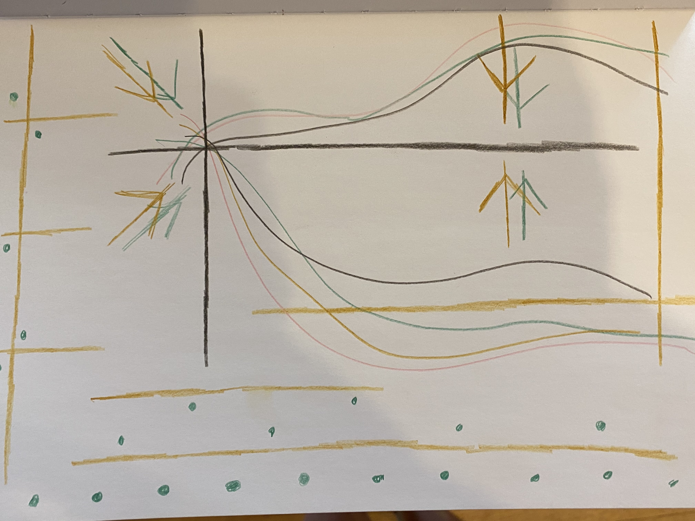
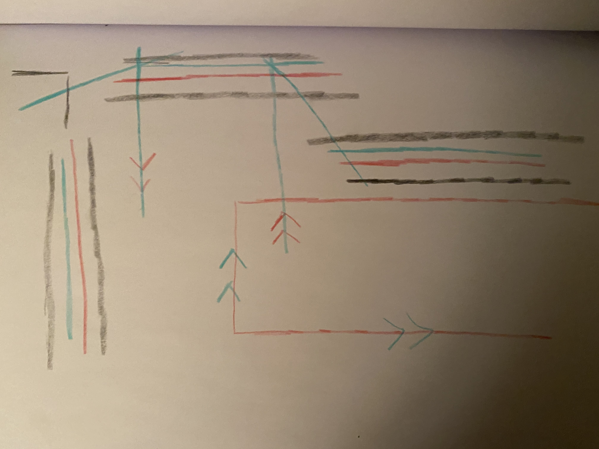
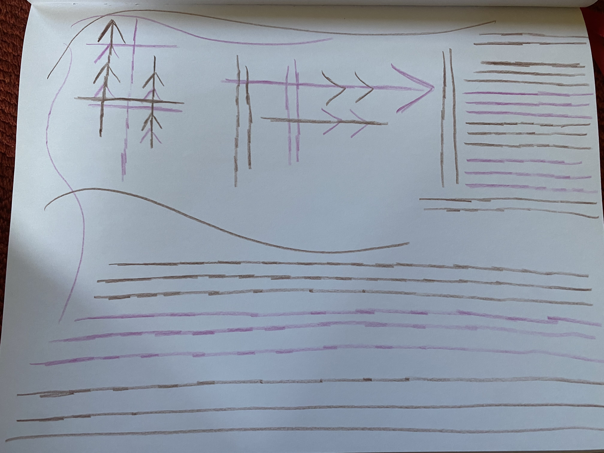
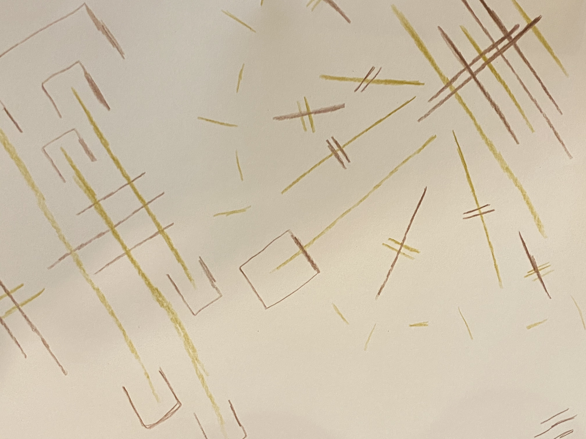
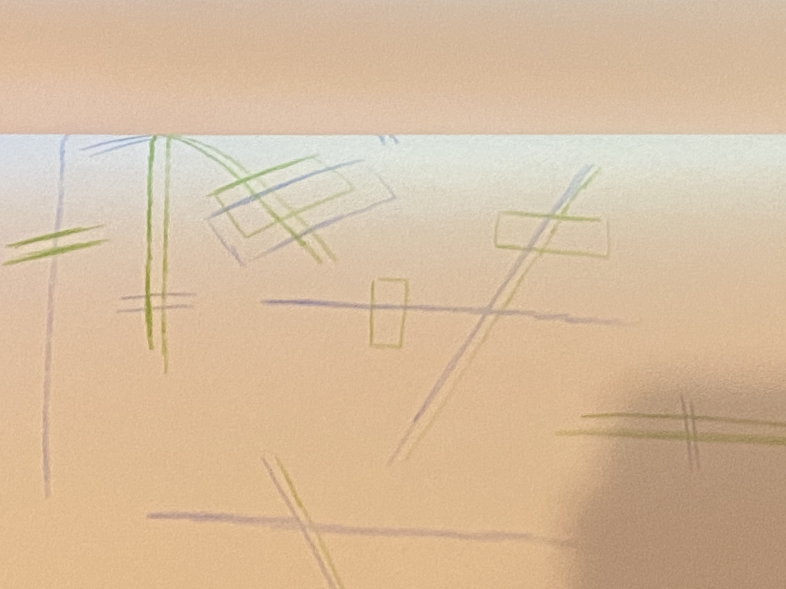

## Sketching and playing with colors and shapes brings me joy. I am a professional historian who has learned to use technology, and I love exploring how to use the visual arts to share history, culture, and engineering and math concepts.

