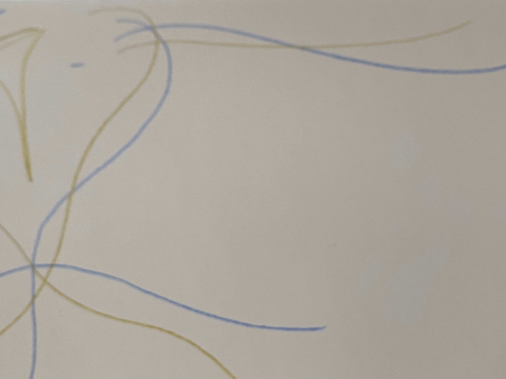
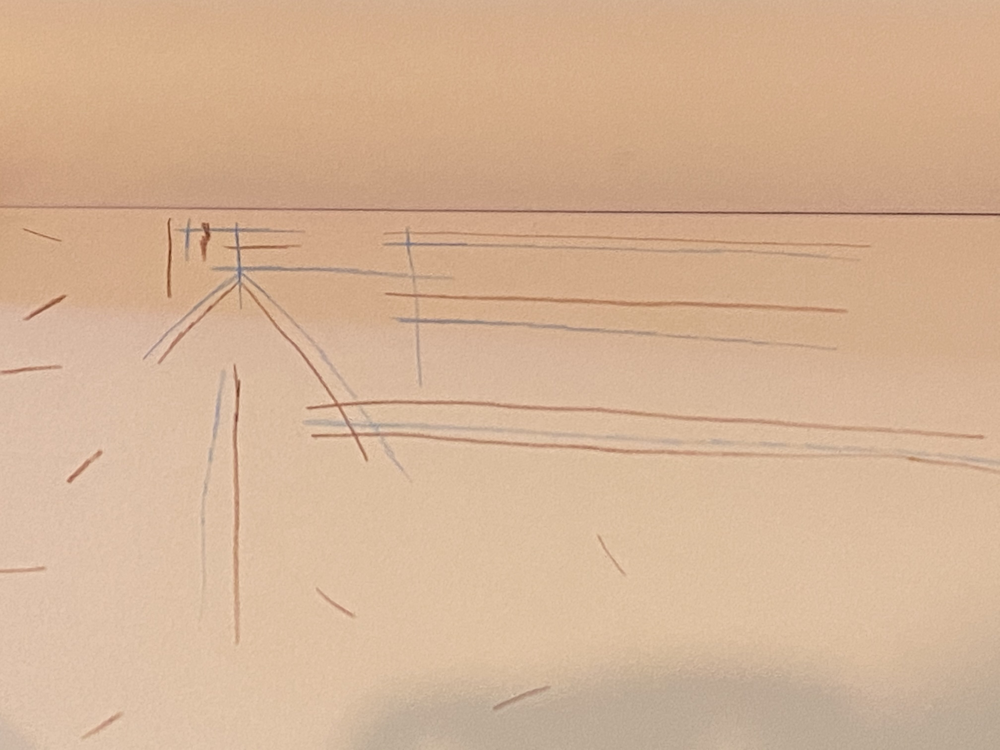

## I love sketching and playing with colors and shapes. After some traumatic experiences and reactions, I am exploring a shift from a professional historian to a professional artist. I have reacted so much over email and text message that I no longer desire to work in history. I hope to explore sunlight and shadows, colors, shapes, and expressing architectural thinking. ## 

